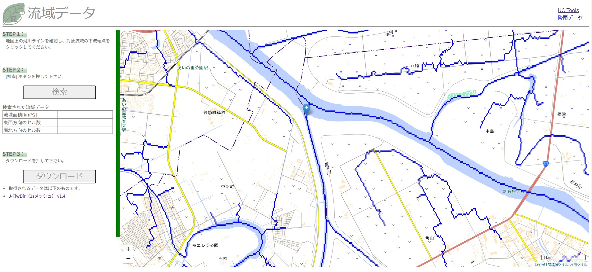
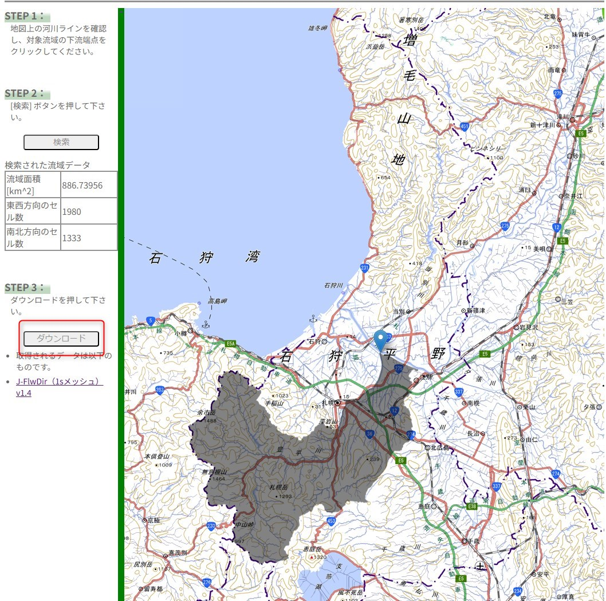
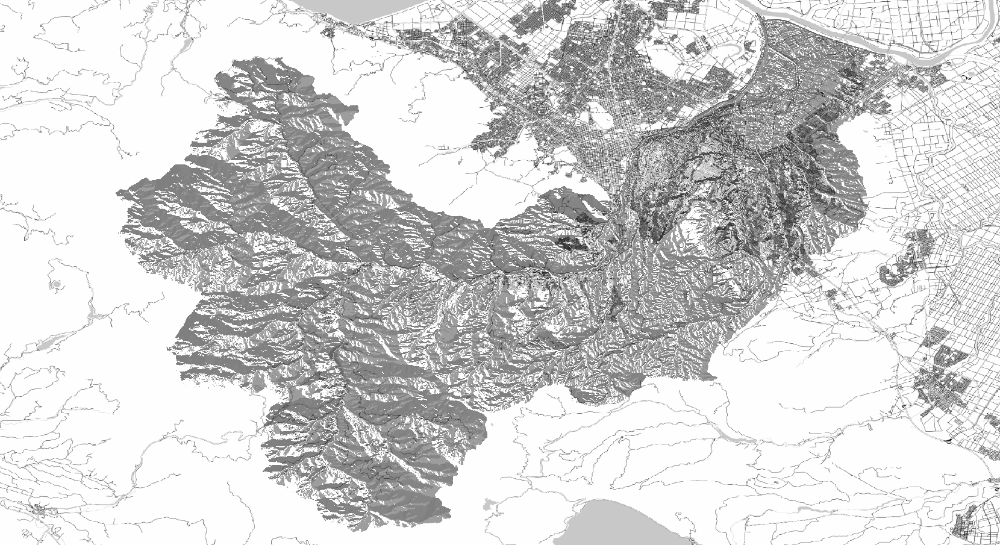
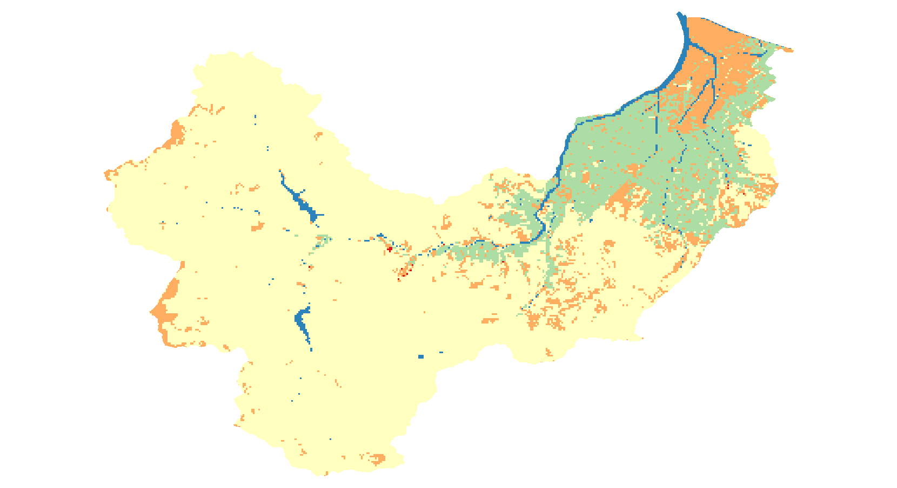

1. 流域地形データセットの取得
~~~~~~~~~~~~~~~~~~~~~~~~~~~~~~
RRIは流域を対象とした計算モデルです。計算には同一格子形状で作成された以下のデータセットが必要になります。

- 標高データ      :　各セルの標高 [必須]
- 集水ピクセル数  :　各セルの上流集水ピクセル数 [必須]
- 落水方向        :　各セルの落水方向（1, 2, 4, 8, 16, 32, 64, 128） [必須]
- 土地利用種別      :　各セルの土地利用 [任意]

つまり、RRIで流出・氾濫計算を行う場合、計算前に対象とした流域について上記データを準備する必要があります。
（一社）iRIC-UCの会員は、　`UC tools <https://tools.i-ric.info/login/>`を利用してデータを入手することができます。

.. note::
   UC toolsを利用すると、日本全国の流域の地形データセットを抽出・ダウンロードすることができます。
   ダウンロードできるデータは、メッシュサイズ（１秒メッシュ）となっています。

   オリジナルデータは、東京大学、生産技術研究所の山崎大准教授らにより作成され、2020年9月時点で山崎大准教授のウェブページで公開されている「日本表面流向マップ」データです。
   「流域データ抽出」サイトでは、それらオリジナルデータから必要な流域のデータを抽出する機能を付与し、データを取得、利用できるようにしています。
   そのため、データ自体は山崎大准教授のホームページに記載されているライセンスに準拠しているため、それらライセンスをご確認の上、データをご利用いただければと思います。

   `詳細はこちら <http://hydro.iis.u-tokyo.ac.jp/~yamadai/JapanDir/>`_

以下に取得手順を示します。

- [1]  `「流域データ抽出」 <https://tools.i-ric.info/login/>`_  にアクセス
- [2] STEP1:対象流域河道の下流端をクリックします。（下図は豊平川の下流端点です。クリックした位置にピンマークが表示されます。）

- [3] STEP2:「検索」ボタンをクリックします。しばらく待つと[2]で指定した地点を下流端とする流域が表示されます。

- [4] STEP3:「取得」ボタンをクリックします。[2]で抽出された流域の地形データセットをダウンロードすることができます。ダウンロードしたファイルを解凍すると以下データが格納されていることが確認できます。
    export_dir.asc　表面流向データ(*)
    export_elv.asc　水文補正標高(*)
    export_hnd.asc　直近の河道からの相対高さ(*)
    export_upa.asc　上流集水面積(*)
    export_upg.asc　上流集水グリッド数(*)
    export_wth.asc　河道幅(*)
    export_ldu.asc　土地利用データ(**)

(*)各データの詳細については、  `「日本域表面流向マップ」 <http://hydro.iis.u-tokyo.ac.jp/~yamadai/JapanDir/>`_   をご確認ください。

(**) 土地利用データは、RRIの開発者である佐山敬洋准教授（京都大学防災研究所）らが中心になって整備されたデータで、日本全国のデータがあります。データはRRI実行のための参考として貸与、配布許可いただいたもので、内容の正確性を保証するものではありません。ご利用は自己責任でお願いいたします。

- [5] [4]でダウンロードしたデータは、QGISなどGISソフトで開き内容を確認することができます。RRIの計算には以下必須（３種類）＋任意（１種類）のデータを利用します。

.. figure:: img/elv_img.png
   :scale: 50%
   :alt:

   水文補正標高を可視化

   表面流向データを可視化　値は1,2,4,8,16,32,64,128の8方向
   

.. figure:: img/acc_img.png
   :scale: 50%
   :alt:

   上流集水グリッド数を可視化

   土地利用データを可視化。土地利用を5種類に区分している。オリジナルデータは「国土数値情報 土地利用細分メッシュデータ」です。