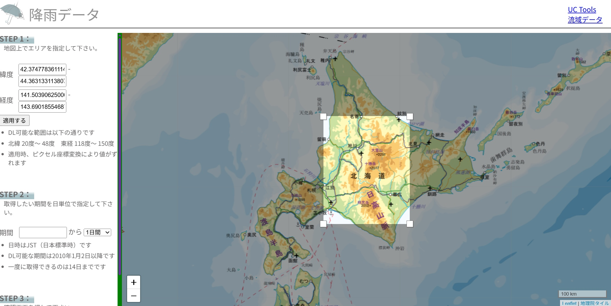
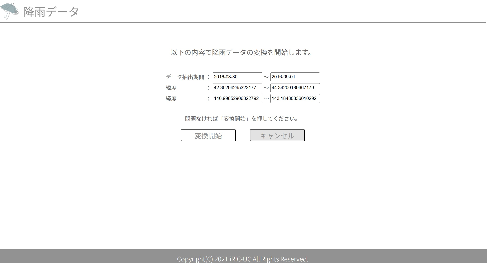
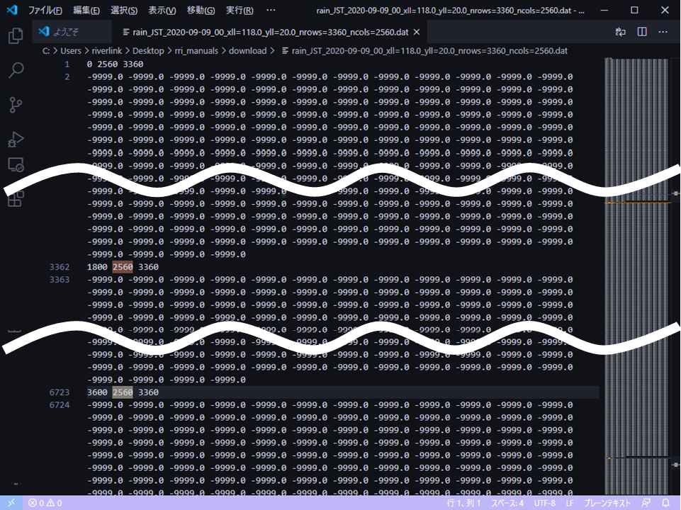

2. Preparation for a rainfall dataset
~~~~~~~~~~~~~~~~~~~~~~~~~~~~~~~~~~~~~

A rainfall dataset for the target basin during a specific period is required for the calculation.
The dataset should include rainfall data that covers the target watershed, for the specified period (e.g., from July 2, 2020, 20:00 to July 4, 2020, 10:00), at regular time intervals (e.g., hourly intervals).

Rainfall intensity data, including both observed and forecasted data, is created and distributed by the Japan Meteorological Agency. Additionally, researchers may generate their own rainfall data using mesoscale models or other methods.

For instructions on preparing the rainfall dataset, please refer to Chapter 4 or Chapter 9 of the RRI_Manual.
By using `UC tools <https://tools.i-ric.info/login/>`_, which is available to anyone upon registration, you can also easily extract rainfall data within Japan.
The procedure is as follows:

In STEP 1, set the area to cover the entire target watershed by entering a latitude/longitude range or dragging on the map, then click "Apply" (適用する).
In STEP 2, set the desired data period.
Then click the confirmation button in STEP 3. The following confirmation screen will appear:

Verify the extraction period and area coordinates, then click "変換開始" (Start Conversion) to download the rainfall data.
When you click "変換開始", the conversion process will begin, and a download URL for the rainfall data will be sent to the email address registered with UC tools.
The information regarding the clipped area (latitude/longitude range) is used as input conditions for the RRI model.

You can use any type of data, but the rainfall data for RRI calculations must be in the following format:

   Rainfall data format:  
   The header row repeats for each time step with `time (sec)`, `ncols`, and `nrows`.
   The mesh size must be consistent.

