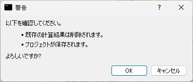
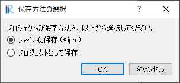
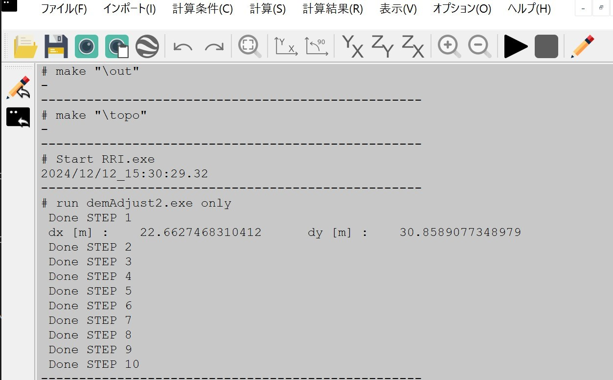
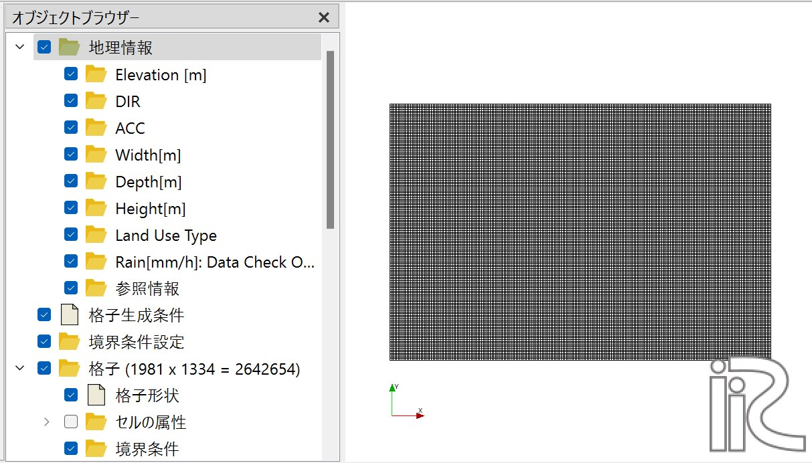
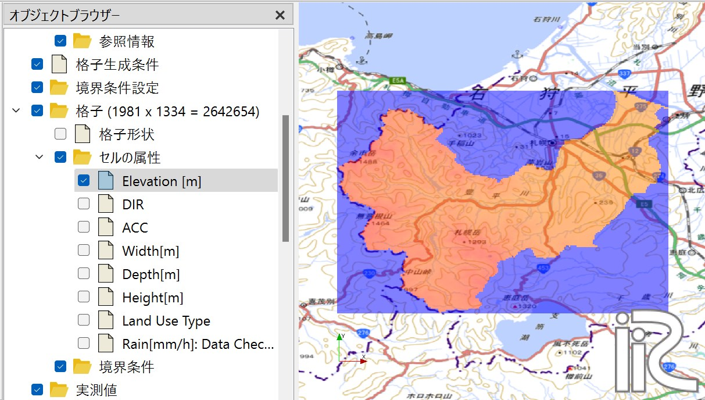
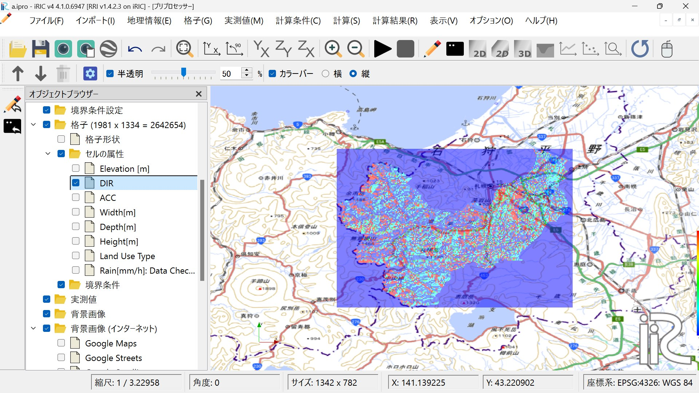
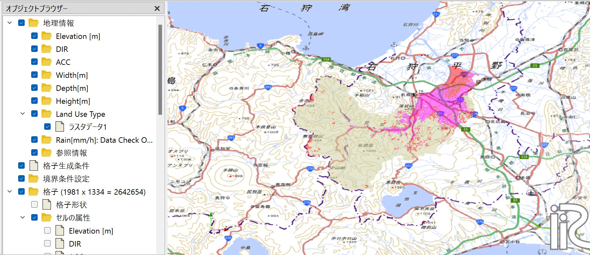
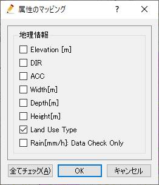
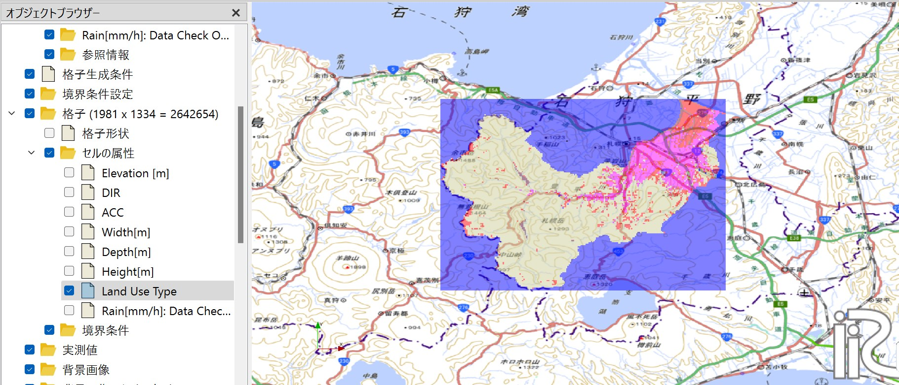

3. 計算条件設定
~~~~~~~~~~~~~~~~~~~~~~~~~~~~~~

iRICソフトウェアを起動し、「新しいプロジェクト」から"RRIv1.4.2.3 on iRIC"を選択します。
警告ウィンドウが表示されますが、無視して「OK」ボタンをクリックしてください。

オブジェクトブラウザーに地理情報としていくつか属性が表示されますが、RRI on iRICは「計算条件」から格子、格子属性の値を指定、作成することを基本としています。
「計算条件＞設定」をクリックしてください。

3.1 格子・格子属性作成・確認
++++++++++++++++++++++++++++++
"RRI on iRIC"では、計算格子を作成しない代わりに、計算条件の基本条件グループで入力された値をもとに格子、格子属性を自動生成します。

.. list-table:: 基本条件グループ
   :widths: 70 30
   :header-rows: 1

   * - 画面
     - 条件
   * - .. image:: img/cond_1.jpg
     - | モード：
       |  「格子・格子属性生成」を選択

       | 1.でダウンロードしたファイルを指定
       |  - DEM: 水文補正標高
       |  - Acc: 上流集水グリッド数
       |  - Dir: 表面流向データ

       | 河道形状をパラメータ指定
       |  - 河道幅: :math:`W = C_w A^{S_w}`
       |  - 河道深: :math:`D = C_D A^{S_D}`
       |  - 堤防: 堤防高[m], 堤防セル閾値

基本条件グループの値を設定後、「保存して閉じる」ボタンをクリックしてください。
「計算＞実行」から計算を実行します。以下の警告が表示されますが、問題ありませんので「はい」をクリックしてください。

さらに保存方法を選択する画面が表示されますので、「ファイルに保存（ipro）」を選択して「OK」ボタンをクリックし、適当な名前を設定して保存してください。

データ処理が始まりまり以下のウィンドウが表示されます。STEP1からSTEP10までの処理があります。

処理が完了すると、以下のウィンドウが表示されます。
「OK」ボタンをクリックし、 **プロジェクトを保存してください** 。

.. figure:: img/calc_end.jpg
   :scale: 80%
   :alt:

-----

上記処理が完了すると、RRIの計算で利用する格子、および、格子属性が確認できるようになります。**「ファイル＞開く」から、先程保存したファイルを再度開いてください** 。
ファイルを開くと上記処理によって作成された格子および格子属性を以下のように確認することができます。

   格子　2,642,654 = 1981 × 1334

   格子属性：Elavation[m]　水文補正標高値。

   格子属性：DIR　流向。East(1),South-East(2),South(4),South-West(8),West(16),North-West(32),North(64),North-East(128)

.. figure:: img/ini_acc.jpg
   :scale: 80%
   :alt:

   格子属性：ACC　上流集水ピクセル数。1セルあたりの面積は同じとしているため、この値に１セルあたりの面積を乗じると、そのセルの集水面積が算出できる。

.. figure:: img/ini_width.jpg
   :scale: 80%
   :alt:
   
   格子属性：Width[m]　河道幅。指定されたパラメータと上流流域面積の関数 :math:`W = C_w A^{S_w}` で河道幅が設定されている。

.. figure:: img/ini_dep.jpg
   :scale: 80%
   :alt:

   格子属性：Depth[m] 河道深さ。指定されたパラメータをと上流流域面積の関数 :math:`D = C_d A^{S_d}` で河道深さが設定されている。

.. figure:: img/ini_height.jpg
   :scale: 80%
   :alt:

   格子属性：堤防フラグ。赤い箇所に堤防が設置されている。
   堤防セル閾値よりも上流集水ピクセル数が大きいセルに、堤防高[m]で指定した高さの堤防が一律に設置されることになります。

----

3.2 降雨条件の設定
++++++++++++++++++++++++++++++
格子および格子属性の確認が完了したら、次に降雨条件の設定を行います。
計算対象地域、期間の降雨データを「2.降雨データセットの作成」に示したフォーマットで準備します。
準備したデータについて以下の値を設定します。

.. list-table:: 降雨データの設定
   :widths: 70 30
   :header-rows: 1

   * - 画面
     - 条件
   * - .. image:: img/cond_2.jpg
     - | - 降雨データファイルを指定
       | - xllcorner_rainを経度(radian)で指定
       | - yllcorner_rainを緯度(radian)で指定
       | - cellsize_rain_xをdx(radian)で指定
       | - cellsize_rain_yをdy(radian)で指定

----

3.3 計算時間の設定
++++++++++++++++++++++++++++++
シミュレーションを行う時間数を指定します。
降雨データや境界データの時間数に関わらず、ここで設定する値で計算対象時間が決定されます。
斜面計算と河道計算のタイムステップは別々に指定することができます。
計算結果出力回数を指定します。初期値は除いて指定します。

.. list-table:: 降雨データの設定
   :widths: 70 30
   :header-rows: 1

   * - 画面
     - 条件
   * - .. image:: img/cond_3.jpg
     - | - シミュレーション時間(hour)
       | - 斜面計算タイムステップ(sec)
       | - 河道計算タイムステップ(sec)
       | - 計算結果出力回数（初期値出力はカウントしない）

----

3.4 河道シミュレーション設定
++++++++++++++++++++++++++++++
河道シミュレーションのパラメータは以下２つです。

- 河道セル判定閾値で指定した値よりも上流集水ピクセル数が大きいセルが河道となります。
- 河道セルと判定された箇所のマニング粗度係数を以下で指定できます。

.. list-table:: 河道シミュレーション設定
   :widths: 70 30
   :header-rows: 1

   * - 画面
     - 条件
   * - .. image:: img/cond_4.jpg
     - | - 河道マニング粗度係数
       | - 河道セル閾値

----

3.5 斜面シミュレーション設定
++++++++++++++++++++++++++++++
斜面シミュレーションのパラメータは、土地利用属性ごとに指定することができます。
土地利用属性は、格子属性として各セルに1から5まで（最大５種類）の値を設定することができます。
ここでは「オブジェクトブラウザ＞Land Use Type」を右クリック、インポートから「1.流域地形データセットの取得」でダウンロードした土地利用データ:export_ldu.ascをインポートします。
インポートが終了すると以下のように土地利用フラグにより、色付け表示されます。

   インポートした土地利用データ

インポートしたデータから格子属性：Land Use Typeを作成します。
「格子＞属性のマッピング」から「実行」をクリックすると、
マッピングする属性を指定する画面が表示されるので、「Land Use Type」を選択し、「OK」ボタンをクリックします。

   マッピング属性選択画面

マッピングが完了すると、
「格子＞セル属性＞Land Use Type」にチェック入れて、格子属性：Land Use Typeを確認することができるようになります。

   格子属性：Land Use Type

格子属性として各セルに設定した1から5の数値に応じたモデルパラメータ群を以下画面で指定します。

.. list-table:: 斜面シミュレーション設定
   :widths: 70 30
   :header-rows: 1

   * - 画面
     - 条件
   * - .. image:: img/cond_5.jpg
     - | - モデルパラメータについては
       | - `RRIのマニュアル <https://www.pwri.go.jp/icharm/research/rri/rri_top.html>`_ を参照ください。

----

3.6 ホットスタート
++++++++++++++++++++++++++++++
ホットスタートは、以前行った計算結果を初期値として計算を開始するような場合に利用します。
そのため出力と入力の設定があります。
出力設定では、ホットスタート用の出力を「行う/行わない」スイッチと、行う場合にはその出力先フォルダを指定します。出力先にはホットスタートの入力設定に必要なファイルが出力されます。
入力設定では、出力された斜面水深、河道水深、gampt_ffのファイルを指定しています。

.. list-table:: ホットスタート設定
   :widths: 70 30
   :header-rows: 1

   * - 画面
     - 条件
   * - .. image:: img/cond_82.jpg
     - | - ホットスタート設定

