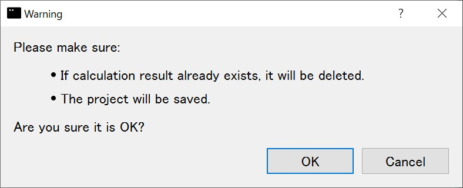
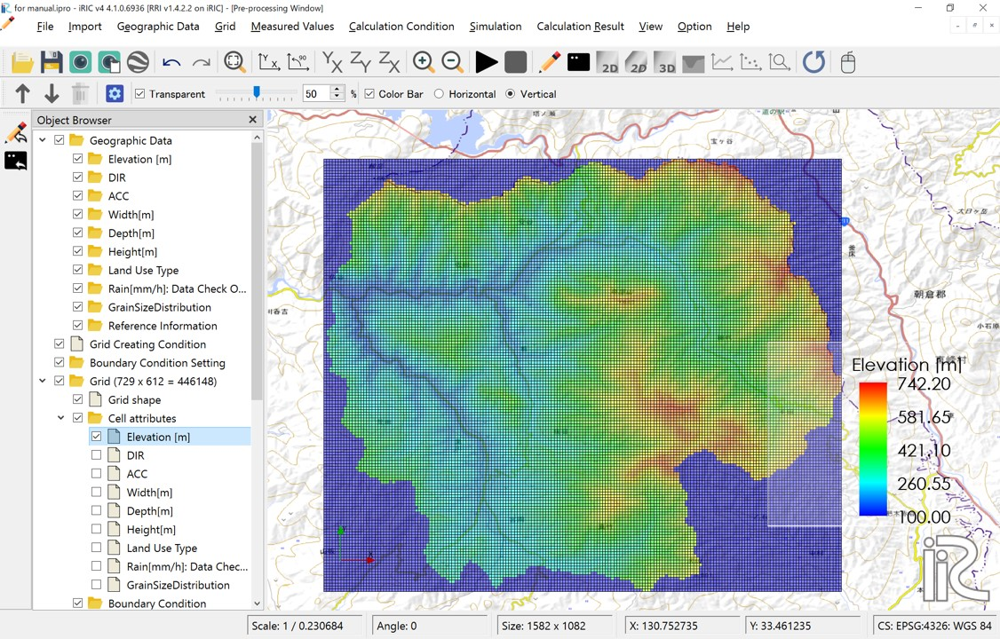
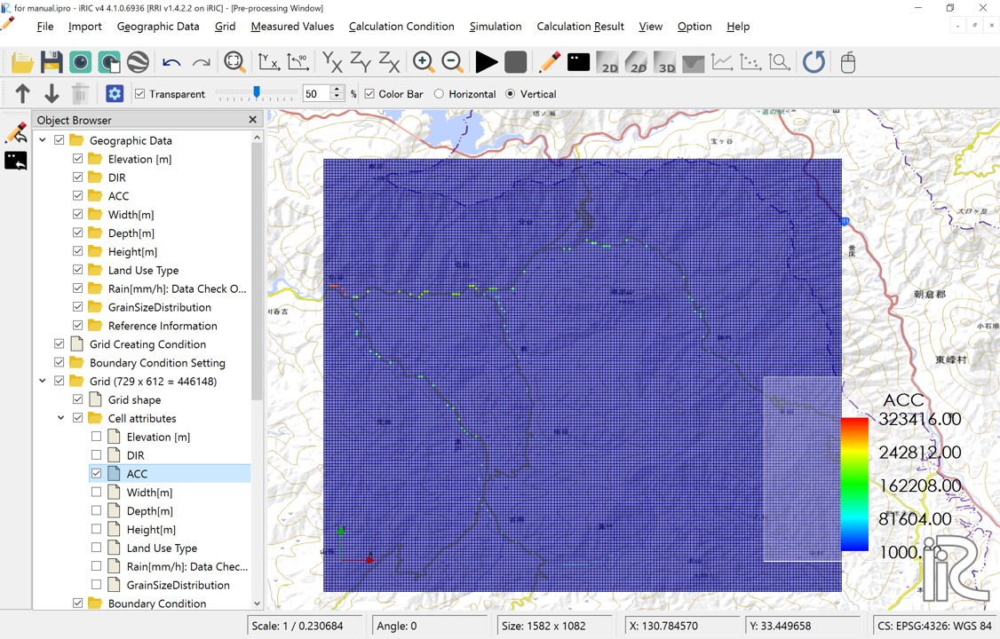

3. Set calculation conditions
~~~~~~~~~~~~~~~~~~~~~~~~~~~~~~

Launch the iRIC software and select "Rainfall-Runoff-Inundation v1.4.2.3" from "New Project."

RRI on iRIC primarily involves specifying and creating grid and grid attribute values through the "Calculation Conditions" menu.

Click on "Calculation Conditions > Settings."

3.1 Creating Grids and Grid Attributes
+++++++++++++++++++++++++++++++++++++++
In "RRI on iRIC," grids and grid attributes are created based on the values entered in the Basic Conditions group of the calculation conditions.

.. list-table:: Basic Conditions Group
   :widths: 70 30
   :header-rows: 1

   * - Screen
     - Condition
   * - .. image:: img/cond_1_en.jpg
     - | Runtype：
       |  Select 'Make Geographic Condition Only'

       | Geograpic Data file：
       | Specify the files downloaded in step 1
       |  - DEM: Hydrologically corrected elevation
       |  - Acc: Number of upstream drainage grids
       |  - Dir: Surface flow direction data

       | River Shape parameters：
       | Specify river channel parameters
       |  - River width: :math:`W = C_w A^{S_w}`
       |  - River depth: :math:`D = C_D A^{S_D}`
       |  - Levee: Levee height [m], Levee cell threshold

After setting these values, click the "OK" button.
Run the calculation by ckicking "Run" button. A warning will appear, but it is not an issue, so click "Yes."

.. figure:: img/nogrid_error_en.jpg
   :scale: 40%
   :alt:

A message recommending that you save the data before running the calculation will appear. Click "Yes."

Next, a screen will prompt you to choose a save method. Select "Save to file (ipro)" and click the "OK" button. Then, set an appropriate name and save the file.

.. figure:: img/save_type_en.jpg
   :scale: 50%
   :alt:

Data processing will begin, and the following window will be displayed. There are processes from STEP1 to STEP8 or 10.

Once processing is complete, click the "OK" button and **save the project**.

-----

Once the above process is complete, you will be able to review the grids and grid attributes for the calculation. **Please reopen the file you saved earlier by selecting "File > Open."**

To review the grids and grid attributes, it is necessary to decignate the coordinate system. After setting your own coordinate, click 'OK'.

After setting the coordinate system, you will be able to review the grid shape and grid atteibutes.

   Grid system

   Cell attributes：Elavation[m]　DEM 

   Cell attributes：DIR　Flow direction; East(1),South-East(2),South(4),South-West(8),West(16),North-West(32),North(64),North-East(128)

   Cell attributes：ACC;　Number of upstream cells. Since cell size is set to be uniform for the entire basin, multiplying this value by the area per cell will give the upstream drainage area for that cell.

   
   Cell attributes：Width[m]　River width; Defined as :math:`W = C_w A^{S_w}` 

   Cell attributes：Depth[m] River depth; Defined as :math:`D = C_d A^{S_d}`

   Cell attributes：Levees are set in the red-colored locations.  
   Levees with the height specified by the levee height [m] are uniformly set in cells where the number of upstream drainage pixels exceeds the levee cell threshold.

----

3.2 Rainfall conditions
++++++++++++++++++++++++++++++
The next step is to set the rainfall conditions.  
Prepare the rainfall data for the target region and period in the format described in "2. Preparation for a rainfall dataset".  

Set the following values for your own prepared data:

.. list-table:: Rainfall Data Settings
   :widths: 70 30
   :header-rows: 1

   * - Screen
     - Conditions
   * - .. image:: img/cond_2_en.jpg
     - | - Specify the rainfall data file
       | - Specify xllcorner_rain in longitude (radians)
       | - Specify yllcorner_rain in latitude (radians)
       | - Specify cellsize_rain_x as dx (radians)
       | - Specify cellsize_rain_y as dy (radians)

----

3.3 Time control
++++++++++++++++++++++++++++++
Set the number of hours for the simulation.  
Regardless of the duration of the rainfall data or boundary data, the calculation period will be determined by the value set here.  
Though the calculation time step is automatically controled by the adaptive Runge-Kutta method,
initial time steps for slope calculations and river channel calculations can be specified separately.  
Set the number of output times for the calculation results, excluding the initial time output.

.. list-table:: Calculation time control
   :widths: 80 20
   :header-rows: 1

   * - Screen
     - Conditions
   * - .. image:: img/cond_3_en.jpg
     - | - Simulation Time (hour)
       | - Time Step for Slope Simulation (sec)
       | - Time Step for River channel
       | Simulation (sec)
       | - Number for output times

----

3.4 River simulation parameters
++++++++++++++++++++++++++++++
The parameters for the river channel simulation are as follows:

- Threshold of flow accumulation: Cells are designated as river channels if their upstream contributing area (number of cells) exceeds this threshold
- Manning's roughness for River Region: This parameter sets the Manning's roughness coefficient for cells identified as river channels.

.. list-table:: River channel settings
   :widths: 70 30
   :header-rows: 1

   * - Screen
     - Conditions
   * - .. image:: img/cond_4_en.jpg
     - | - Manning's roughness for River Region
     - | - Threshold of flow accumulation

----

3.5 Slope simulation parameters
++++++++++++++++++++++++++++++
The parameters for the slope simulation can be defined individually for each land use category. 
Land use categories are assigned to each grid cell as attributes, with values from 1 to 5, allowing for up to five distinct categories. 
To set these up, import the land use data file (ldu_export.asc downloaded in step "1. Preparation for the Basin Terrain Dataset") by right-clicking "Land Use Type" in the Object Browser and selecting "Import". 
Once imported, the display will visually differentiate the cells by color, based on their assigned land use flags.

   Imported Land Use Data

Mapping the Imported Land Use Data to the Grid:
To map the imported land use data to the grid, go to "Grid" > "Attribute Mapping" and click "Execute". 
This will open a window where you can specify the attribute to map. Select "Land Use Type" and click the "OK" button.

   Attribute Mapping Selection Window

Once the mapping process is finished, the land use types will be associated with the grid cells. 
You can verify this by navigating to "Grid" > "Cell Attributes" in the menu and then checking the box labeled "Land Use Type". 
This will display the mapped land use type as a cell attribute.

   Cell attributes：Land Use Type

The following screen allows you to specify model parameter sets. Each set corresponds to the numerical values 1 to 5 assigned as grid attributes to each cell.

.. list-table:: Slope simulation parameters
   :widths: 70 30
   :header-rows: 1

   * - Screen
     - Conditions
   * - .. image:: img/cond_5_en.jpg
     - | - Information regarding
       | model parameters can be
       | found in the `RRI manual <https://www.pwri.go.jp/icharm/research/rri/rri_top.html>`_ .

----

3.6 Hotstart
++++++++++++++++++++++++++++++
Hot start is used when you want to start a calculation using the results of a previous calculation as the initial values. This screen allows you to set the previously calculated slope water depth (hs), river channel water depth (hr), etc., as initial conditions.

.. list-table:: Hotstart
   :widths: 70 30
   :header-rows: 1

   * - Screen
     - Conditions
   * - .. image:: img/cond_8_en.jpg
     - | - Hotstart 

