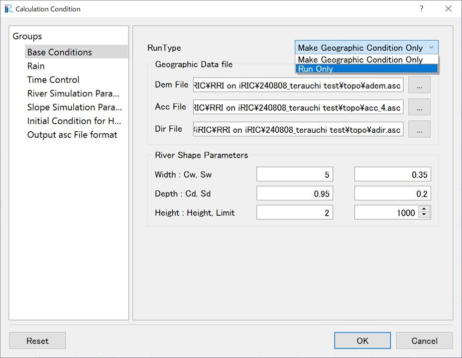

5. Running the Calculation
~~~~~~~~~~~~~~~~~~~~~~~~~~~~~~
After creating the grid and grid attributes and setting other calculation conditions in the Calculation Condition Setting, the next step is to execute the calculation. 
Go to "Calculation Condition" > "Setting" to open the Calculation Condition Setting window and select "Basic Conditions." 
In "RunType", choose "Run only" and click "OK."

Clicking "Run" will start the calculation.

