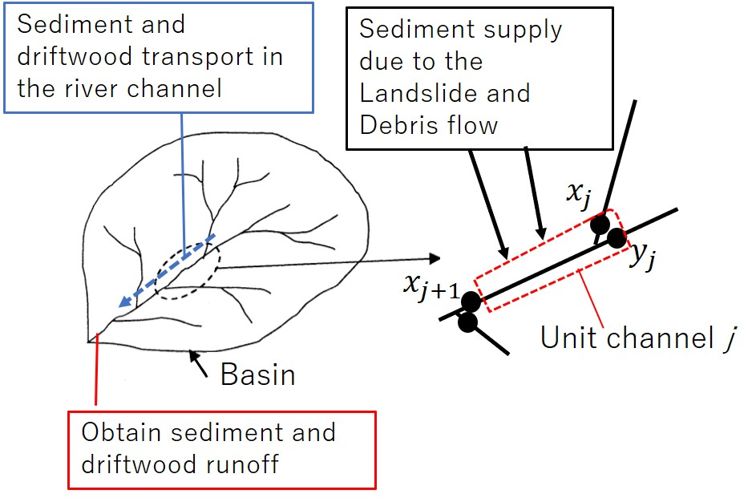
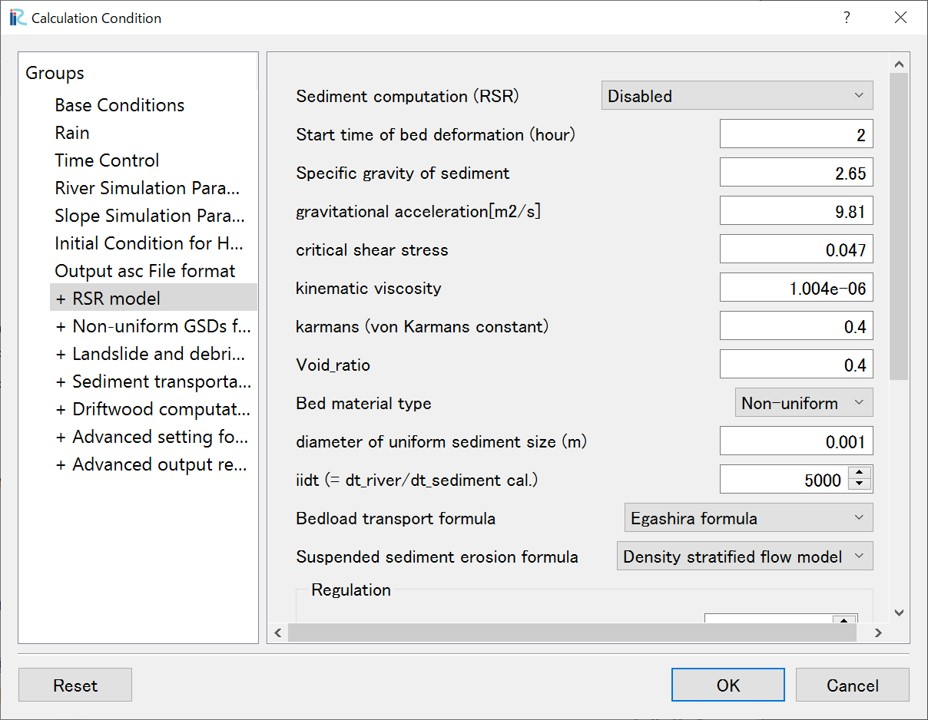
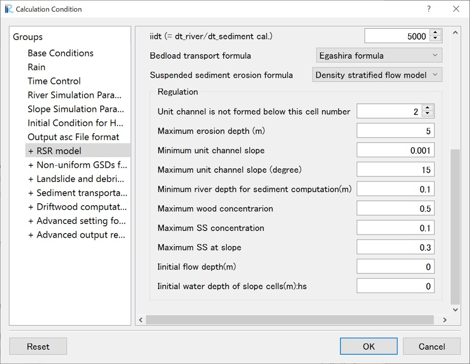
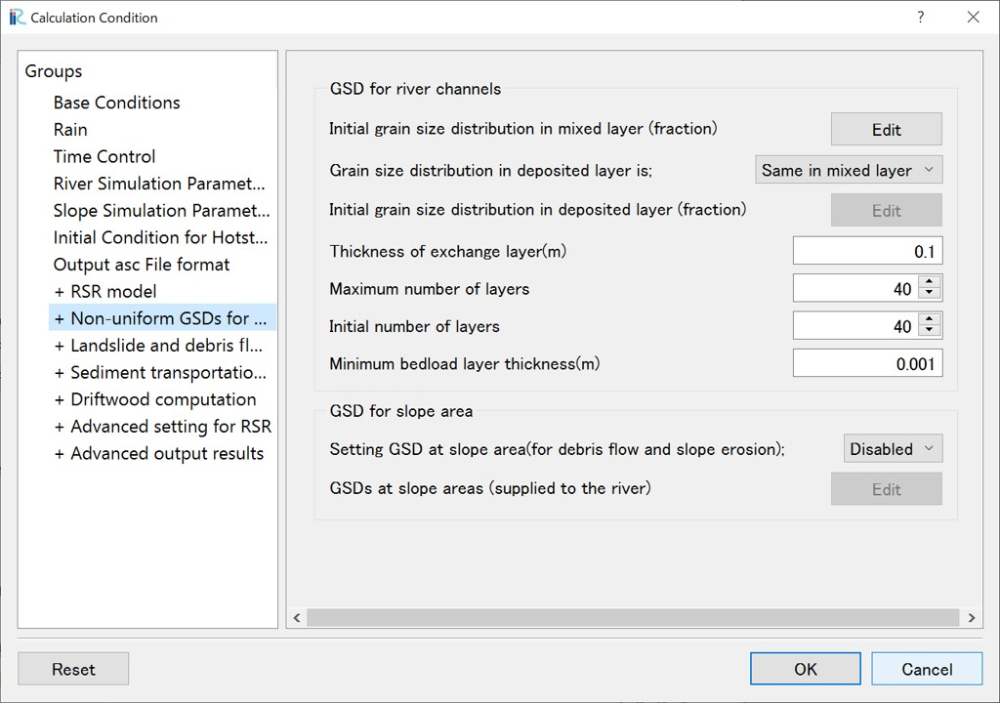
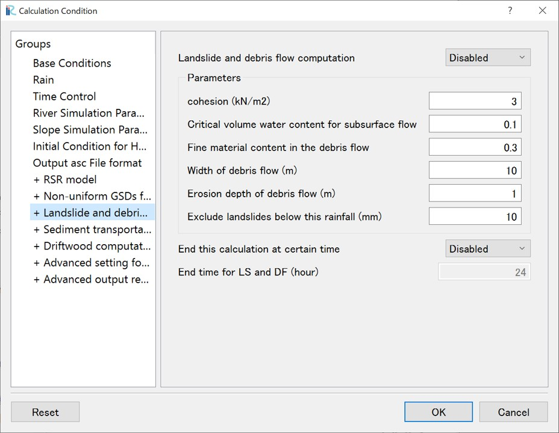
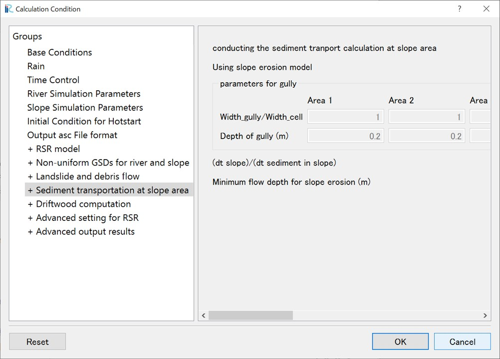
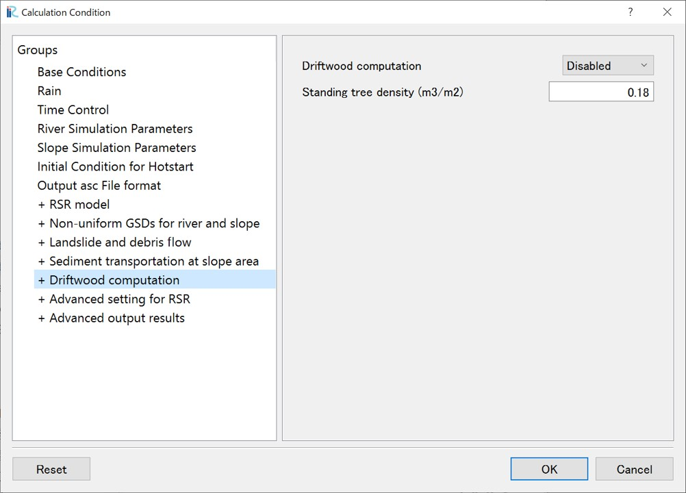
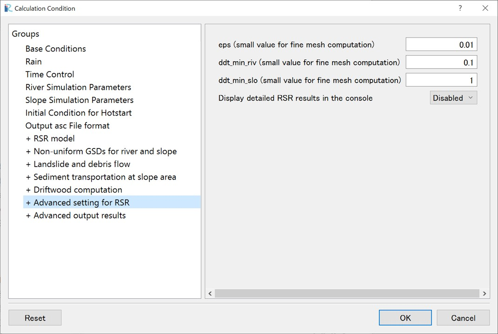
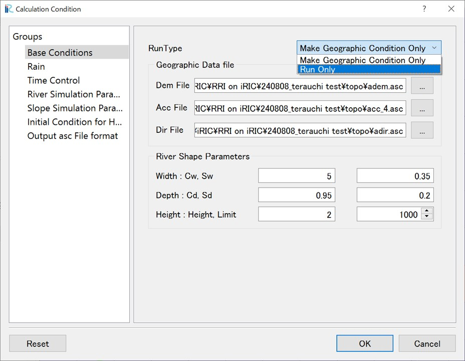

6. Rainfall-Sediment-Wood Runoff (RSR) model（option）
~~~~~~~~~~~~~~~~~~~~~~~~~~~~~~

6.1. Overview of the Rainfall-Sediment-Wood Runoff (RSR) Model
--------------------------------------------------

The RSR model is designed to analyze the water, sediment, and driftwood runoff in a watershed, using the hydraulic information of slopes and river channels calculated by the RRI model. 
The model employs a "unit river channel" model, where each unit river channel is defined as the section between confluences of the river channel cells in the RRI model. 
This model enables the analysis of flood disasters induced by sediment, as well as the long-term sediment treansport of the watershed. 
It is also possible to perform sediment transport and riverbed variation calculations in each cell without using the unit river channel model. 
For more detailed information, including the governing equations, please refer to the cited references. Note that the RSR model is currently under development and will be updated sequentially.

① Sediment Supply to River Channels (Optional)：

①-1：Sediment Supply from Landslides and Debris Flows [1]_ ,: 
Using calculated water depth information at slope cells, slope stability analysis is performed for all slope cells within the watershed to determine the occurrence of landslides. 
If a landslide occurs, the movement of the collapsed soil is tracked using a mass-point-based model along the steepest direction of the slope. 
If the debris flow reaches a river channel cell, the sediment is treated as lateral inflow to the river channel. 
When using this model, a fine mesh size (e.g., 10-30m) is required to accurately evaluate slope failures.

①-2：Sediment Supply to River Channels from Hillslope Erosion [2]_ ,: 
Using calculated water depth information at slope cells, the amount of soil erosion on the slopes is calculated using a suspended sediment erosion rate formula. 
The eroded suspended sediment is transported at the slope and is supplied to the river channel.

②Sediment Transport in River Channels [3]_ , [4]_ ,：

After the calculation starts, the program automatically generates "unit river channels," with each unit defined as the reach between confluences within the river channel cells. 
Using the average hydraulic quantities (water depth, discharge, channel width, etc.) of the river channel cells within each unit river channel, bed load and suspended load transport are evaluated. 
By arranging these unit river channels in series and parallel, sediment transport throughout the entire watershed is analyzed. 
Although the program allows for analysis at the individual cell level, this is not recommended due to computational stability concerns.

③Driftwood Transport  [5]_ , ：

This component analyzes the transport of driftwood throughout the entire watershed. 
If landslides and debris flows are analyzed in ①-1, all standing trees on the path of the debris flow are assumed to be incorporated into the debris flow. 
If the debris flow reaches a river channel, this driftwood is evaluated as lateral inflow to the river channel. 
In the river channel, the transport of driftwood is analyzed using convection and storage equations within the unit river channel model.

.. [1] `Yamazaki, Y., Egashira, S., & Iwami, Y.: Method to Develop Critical Rainfall Conditions for Occurrences of Sediment-Induced Disasters and to Identify Areas Prone to Landslides, Journal of Disaster Research, 11(6), pp.1103-1111, 2016. <https://www.jstage.jst.go.jp/article/jdr/11/6/11_1103/_article/-char/en/>`_
.. [2] `Qin, M., Harada, D., & Egashira, S. (2023). Influences of hillslope erosion on basin-scale sediment transport processes, proceedings of the 40th IAHR World Congress, August 2023. <https://www.iahr.org/library/infor?pid=29673>`_
.. [3] `Harada, D., & Egashira, S. (2024). Methods to create hazard maps for flood disasters with sediment and driftwood. Proceedings of IAHS, 386, 159-164. <https://piahs.copernicus.org/articles/386/159/2024/>`_
.. [4] `原田大輔, 江頭進治, 秦梦露. (2024). 降雨-土砂・流木流出モデルの特性-土砂粒度分布と流木の時空間変化に着目して. 河川技術論文集, 30, 335-340. <https://www.jstage.jst.go.jp/article/river/30/0/30_335/_article/-char/ja/>`_
.. [5] `Harada, D., & Egashira, S. (2023). Method to evaluate large-wood behavior in terms of the convection equation associated with sediment erosion and deposition. Earth Surface Dynamics, 11(6), 1183-1197. <https://esurf.copernicus.org/articles/11/1183/2023/esurf-11-1183-2023.html>`_

6.2. Setting Calculation Conditions (Basic Conditions)
--------------------------------------------------

This section describes the basic calculation conditions for the Rainfall-Sediment Runoff (RSR) model.

- Sediment computation (RSR): Select "Disabled", "Cell model (not recommended)", or "Unit channel model".
- Start time of bed deformation (hour)：After the start of the RRI model calculation, sediment calculations will not be performed for times earlier than this.
- Critical shear stress：Set this value when calculating uniform sediment sizes.
- Bed material type：Uniform or non-uniform
- iidt (= dt_river/dt_sediment cal.)：Time Step for Riverbed Variation Calculation: Sets how many times sediment calculations are performed within one calculation time interval of the river channel in the RRI model. When dealing with suspended sediment, a smaller time step (larger iidt value here) will improve calculation stability.
- Bedload transport formula：Select from Ashida-Michiue formula, MPM formula, or Egashira et al. formula.
- Suspended sediment erosion formula：Select from Lane-Kalinske formula or Density stratified flow model.
- Other parameters are standard values.

Next, the detailed calculation conditions (regulations) are explained.

- Unit channel is not formed below this cell number：The RSR model automatically identifies confluence points of the river channel cells set in the RRI model and generates unit river channels for the entire watershed. However, if extremely small unit river channels are generated, calculations may become unstable. Therefore, unit river channels with fewer cells than this value will not be generated.
- Maximum erosion depth (m)：Erosion in a unit river channel is not allowed below this depth relative to the initial riverbed elevation, treating it as bedrock.
- Minimum unit channel slope：When employing the Egashira et al. formula for bed load transport, the exchange layer thickness is dynamically evaluated. If the bed slope of the unit river channel is milder than this value, this value will be set as the unit river channel bed slope.
- Maximum unit channel slope (degree)：If the gradient of a channel cell is greater than this value, cells upstrem of this degree will not be treated as the unit channel.
- Minimum river depth for sediment computation(m)：The average water depth of the river channel cells within a unit channel is employed as the water depth for the unit channel. If the water depth is shallower than this value, sediment transport calculations will not be performed at that unit channel.

6.3. Non-uniform GSDs for river and slope
--------------------------------------------------

This section describes how to set the grain size distribution (GSD) for non-uniform sediment.

- Initial grain size distribution in mixed layer (fraction)：Sets the initial conditions for the grain size distribution of the surface layer of the river channels. It is possible to set different initial conditions for each area (Section 1-10). In that case, specify each area in the Object Browser > Grain Size Distribution for channel
- Grain size distribution in deposited layer：Set this when providing different grain size distributions for the surface layer and the exchange layer below it.
- Thickness of exchange layer(m)：When employing the Ashida-Michiue formula for bed load transport, the exchange layer thickness is given as a fixed value and is set here.
- Minimum bedload layer thickness(m)：When employing the Egashira et al. formula for bed load transport, the exchange layer thickness is dynamically calculated, and its minimum value is set here.
- GSD for slope area：Sets the grain size distribution of sediment supplied to the river channel from landslides and debris flows (①-1) and hillslope erosion (①-2).

6.4. Landslide and debris flow
--------------------------------------------------
This section describes the calcilation conditions and parameters when performing landslide and debris flow analysis (①-1).

- For general parameter setting methods, please refer to references such as [1]_.
- Exclude landslides below this rainfall (mm): In landslide analysis, stability calculations are performed for all slope cells within the watershed. Due to the influence of the initial elevation (DEM), slope failures may be triggered even with small amounts of rainfall. To avoid this, slope failure calculations are not performed for slopes that would fail with rainfall amounts below this threshold.
- End time for LS and DF (hour): Landslide and debris flow calculations takes time because they are performed for all slope cells in the watershed. However, landslides and debris flows tend to occur primarily during the peak of heavy rainfall events. By stopping the landslide and debris flow analysis after a specified "End time for LS and DF (hour)", the total calculation time can be reduced. Landslide and debris flow analysis will not be performed after the time set here.

6.5. Sediment transport at slope area
--------------------------------------------------
This section describes the calculation conditions and parameters when performing sediment transport analysis on slope cells (①-2).

- Parameters can be set for each area (Area 1-10). To set parameters for each area, specify each area in the Object Browser > Grain Size Distribution for slope area.
- To set uniform parameters for the entire watershed, set only the parameters for Area 1.
- Width_gully/Width_cell: When the grid size of the slope cells is large, sediment transport may occur only in a portion of the cell. In this case, set the width of the gully where sediment transport occurs relative to the cell size.
- Depth of gully (m): Set the allowable slope erosion depth.
- (dt slope)/(dt sediment in slope): Sets how many times sediment transport analysis on slope cells is performed within one calculation time interval of the slope in the RRI model.
- Minimum flow depth for slope erosion (m): Sediment transport analysis on each slope cell is not performed when the surface water depth is less than this value.

6.6. Driftwood computation
--------------------------------------------------
Driftwood calculations can be performed when conducting landslide and debris flow analysis (①-1), as described in Section 6.4. 
For details on the method of analyzing driftwood using convection and storage equations, please refer to references such as [6]_.
Currently, the model assumes that all standing trees on the path of the debris flow is assumed to be incorporated into the debris flow, 
and if the debris flow reaches a river channel, the driftwood is supplied to the channel. 
The density of standing trees is set as a parameter.

6.7. Advanced settings for the RSR model
--------------------------------------------------
The RRI model uses the Adaptive Runge-Kutta method, which automatically adjusts the calculation time step (default: 600 seconds for slopes, 60 seconds for river channels, see Section 3.3) 
to ensure that the error in the convergence calculation is below a certain value (eps). 
When using a small mesh size, such as 10m, in the RSR model analysis, reducing the value of eps (for example, by one order of magnitude) can stabilize the calculation.
Similarly, ddt_min_riv is the truncation error for river channel calculations, and ddt_min_slo is the truncation error for slope calculations.
When using a small mesh size like 10m, reducing these values by about one order of magnitude can help prevent calculation failures.

6.8. Running the Calculation
--------------------------------------------------
After setting the calculation conditions, execute the calculation. 
From "Calculation Condition > Setting", open the calculation condition setting screen and select "Base Conditions". In "Runtype", select "Run only", and click "Save and Close". Click "Simulation > Run" to start the calculation.

Visualization of the calculation results will be explained in "Examples".

