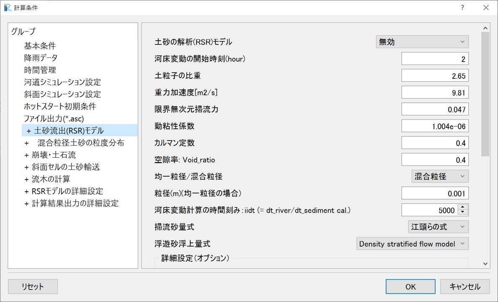
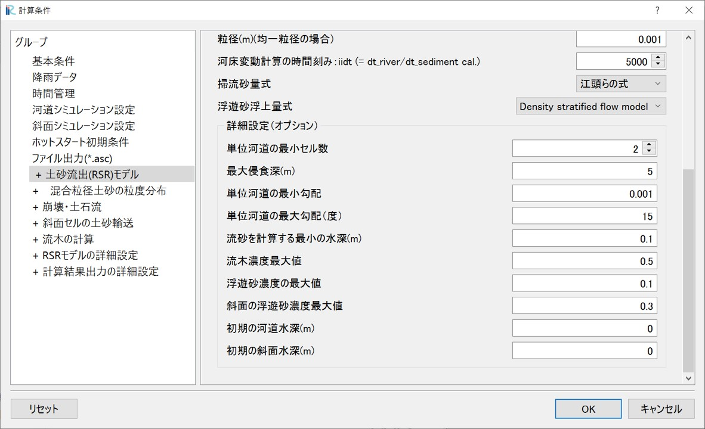
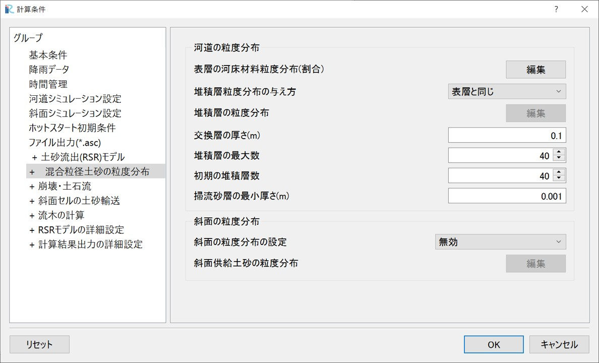
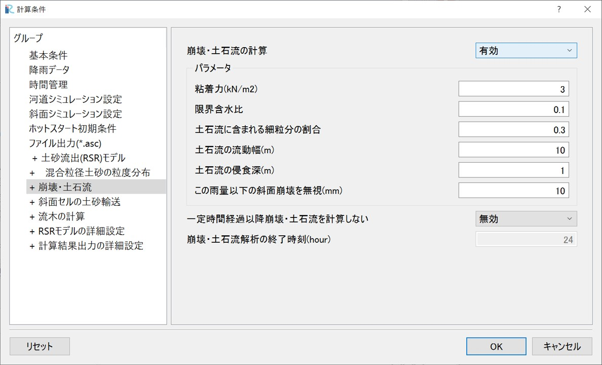
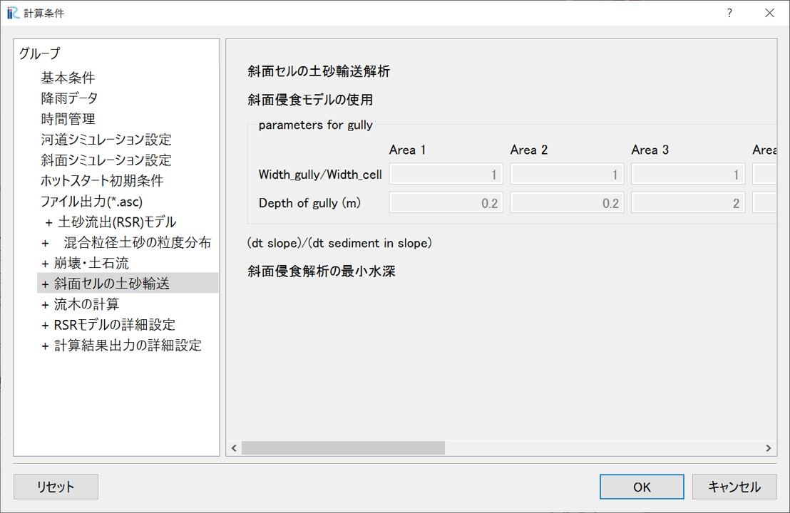
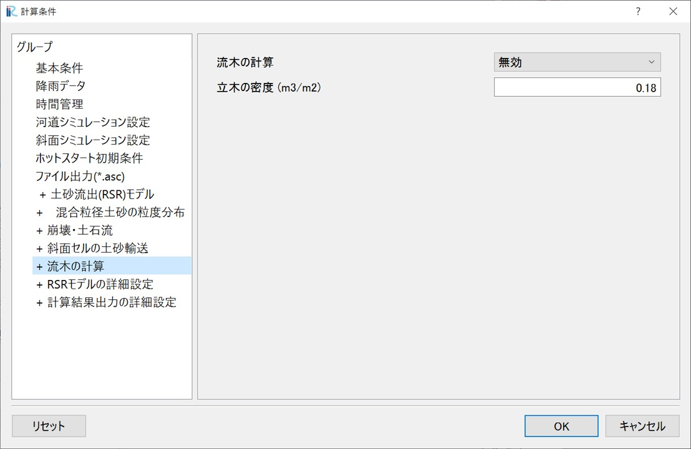
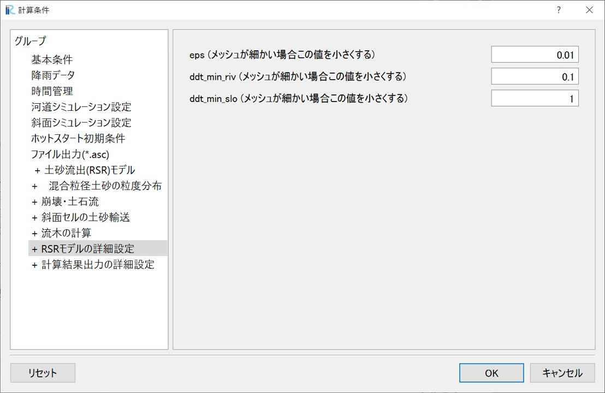
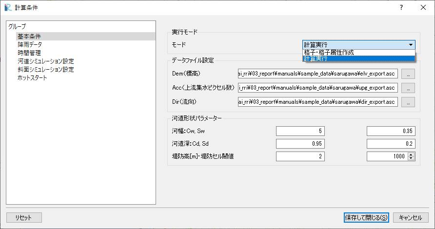

6. 降雨-土砂流出(RSR)モデル（オプション）
~~~~~~~~~~~~~~~~~~~~~~~~~~~~~~

6.1. 降雨-土砂流出(RSR)モデルの概要
--------------------------------------------------

RRIモデルで解析した斜面と河道の水理量に関する情報を用いて、RRIモデルの河道セルの合流点間を「単位河道」とする
単位河道モデルによって流域全体の水・土砂・流木の輸送を解析するモデルです。
いわゆる「土砂・洪水氾濫」などの災害の解析や、流域の長期土砂流出などの解析を行うことができます。
単位河道モデルを用いず、それぞれのセルで流砂・河床変動の計算を行うことも可能です。
基礎方程式等、より詳細な情報については参考文献を参照してください。なお、RSRモデルは開発中であり、逐次アップデートされる予定です。

.. figure:: img/RSR_scheme_1.jpg
   :scale: 60%
   :alt:

①河道への土砂供給（オプション）：

①-1：崩壊・土石流による土砂供給 [1]_ ,  [2]_ , ：斜面セルの水深の情報を用いて、流域内全ての斜面セルで斜面安定・不安定解析を行い、崩壊の発生を判定します。
斜面崩壊が起きた場合、質点系の方程式を用いて斜面の最急勾配方向へと崩土の移動を追跡します。その結果河道セルに土石流が到達すれば、河道に土砂が横流入したものとして扱います。
このモデルを用いる場合、斜面崩壊を評価できるよう、10~30mといった細かいメッシュを用いる必要があります。

①-2：斜面侵食による河道への土砂供給 [3]_ ,：斜面セルの水深の情報を用いて、浮遊砂浮上量式によって斜面の土砂侵食量を求めます。侵食された浮遊砂は斜面を移動して河道へと供給されます。

②河道の土砂輸送 [4]_ ,  [5]_ , ：

計算開始後、河道セルにおいて合流点間を単位とする「単位河道」を自動的に生成します。
単位河道内の河道セルの水理量（水深、流量、川幅等）の平均値を用いて掃流砂・浮遊砂を評価し、単位河道を直列及び並列に配置することによって流域全体の土砂輸送を解析します。
本プログラムではセル一つ一つでの解析も可能ですが、計算の安定性の観点からあまり推奨しません。

③流木の輸送 [6]_ , ：

流域全体の流木の流出を解析するものです。①-1で崩壊・土石流を解析すれば、崩土の移動経路上にある立木は全て土石流に取り込まれ、土石流が河道に到達すれば、これを河道への横流入として評価します。
河道では移流方程式と貯留方程式を用いて、単位河道モデルによって流木の輸送を解析します。

.. [1] `Yamazaki, Y., Egashira, S., & Iwami, Y.: Method to Develop Critical Rainfall Conditions for Occurrences of Sediment-Induced Disasters and to Identify Areas Prone to Landslides, Journal of Disaster Research, 11(6), pp.1103-1111, 2016. <https://www.jstage.jst.go.jp/article/jdr/11/6/11_1103/_article/-char/en/>`_
.. [2] `山崎祐介, & 江頭進治. (2021). 豪雨にともなう洪水・土砂流出ハイドログラフの推定手法. 河川技術論文集, 27, 469-474. <https://www.jstage.jst.go.jp/article/river/27/0/27_PS2-42/_article/-char/ja/>`_
.. [3] `Qin, M., Harada, D., & Egashira, S. (2023). Influences of hillslope erosion on basin-scale sediment transport processes, proceedings of the 40th IAHR World Congress, August 2023. <https://www.iahr.org/library/infor?pid=29673>`_
.. [4] `Harada, D., & Egashira, S. (2024). Methods to create hazard maps for flood disasters with sediment and driftwood. Proceedings of IAHS, 386, 159-164. <https://piahs.copernicus.org/articles/386/159/2024/>`_
.. [5] `原田大輔, 江頭進治, 秦梦露. (2024). 降雨-土砂・流木流出モデルの特性-土砂粒度分布と流木の時空間変化に着目して. 河川技術論文集, 30, 335-340. <https://www.jstage.jst.go.jp/article/river/30/0/30_335/_article/-char/ja/>`_
.. [6] `Harada, D., & Egashira, S. (2023). Method to evaluate large-wood behavior in terms of the convection equation associated with sediment erosion and deposition. Earth Surface Dynamics, 11(6), 1183-1197. <https://esurf.copernicus.org/articles/11/1183/2023/esurf-11-1183-2023.html>`_

6.2. 計算条件の設定（基本条件）
--------------------------------------------------

降雨-土砂流出（RSR）モデルの基本的な計算条件について説明します。

- 土砂の解析(RSR)モデル：「無効」、「セルごとに解析（非推奨）」または「単位河道モデル」を選択します。
- 河床変動の開始時刻(hour)：RRIモデルの計算開始後、これ以前の時間は、土砂の計算を行いません。
- 無次元限界掃流力：一様粒径を扱う場合に設定します。
- 均一粒径/混合粒径：均一粒径、混合粒径のどちらも選択可能です。
- 河床変動計算の時間刻み：一回のRRIモデルの河道の計算時間間隔（デフォルトは60秒）の間に、土砂の計算を何回行うかを設定します。浮遊砂を扱う場合、時間刻みを細かく（この数字を大きく）した方が計算が安定します。ただし値を大きくするほど計算時間が長くなります。
- 掃流砂量式：芦田・道上式、MPM式、江頭らの式、から選択可能です。
- 浮遊砂浮上量式：Lane-Kalinskeの式、Density stratified flow model、から選択可能です。
- その他のパラメータは一般的なものです。

次に、詳細な計算条件設定（制約条件）について説明します。

- 単位河道の最小セル数：RSRモデルでは、RRIモデルで設定した河道セルの合流点を自動的に判別し、流域全体で単位河道を生成します。ただしあまりにも小さい単位河道が生成されれば計算が不安定になることがあるので、この値よりも小さいセルでの単位河道は生成しません。
- 最大侵食深(m)：初期の河床高に対して、この深さ以上の単位河道の侵食を許容せず、岩盤として扱います。
- 単位河道の最小勾配：掃流砂量式として江頭らの式を使う場合、交換層厚を動的に評価します。単位河道の河床勾配として、この値より勾配が緩い場合にこの値を採用します。
- 単位河道の最大勾配（度）：河道セルの勾配がこの値より大きい場合、その河道セルよりも上流側の河道セルは単位河道として設定しません。
- 流砂を計算する最小の水深(m)：単位河道の水深として、単位河道内の河道セルの水深の平均値を用います。水深がこの値より小さい場合に、流砂の計算を行いません。

6.3. 混合粒径土砂の粒度分布
--------------------------------------------------

混合粒径土砂の粒度分布の設定方法について説明します。

- 表層の河床材料粒度分布（割合）：河床表層の粒度分布について、初期条件を設定します。エリア毎（Section1～10）に異なる初期条件を設定することも可能で、その場合はオブジェクトブラウザ＞河道の粒度分布　で各エリアを指定します。
- 堆積層粒度分布の与え方：表層とそれより下の交換層とで異なる粒度分布を与える場合に設定します。
- 交換層の厚さ：掃流砂量式として芦田・道上式を用いる場合、交換層を固定値として与えるためここで設定します。
- 掃流砂層の最小厚さ：掃流砂量式として江頭らの式を用いる場合、交換層を動的に与えるため、その最小値をここで設定します。
- 斜面の供給土砂：崩壊・土石流（①ー１）、及び斜面侵食によって河道に流入する土砂の粒度分布について設定します。

6.4. 崩壊・土石流の条件設定
--------------------------------------------------
崩壊・土石流の解析（①ー１）を行う場合、解析条件、解析パラメータ等をここで設定します。

- 一般的なパラメータ設定法については文献 [1]_ ,等を参照してください。
- この雨量以下の斜面崩壊を無視：崩壊・土石流の解析では流域内の全ての斜面セルで安定解析を行います。初期の地形データ（DEM）の影響で、わずかの雨でも斜面崩壊が判定される場合があります。それを避けるために、この雨量以下で崩壊する斜面に対しては斜面崩壊の計算を行いません。
- 一定時間経過以降　崩壊・土石流を計算しない：崩壊・土石流の計算は流域内全ての斜面セルで行うため、計算時間が長くなります。一方で、崩壊・土石流の発生は豪雨のピーク時に限られており、豪雨のピーク以降崩壊・土石流の解析を行わないことで総計算時間を短縮できます。ここで設定する「崩壊・土石流解析の終了時刻」以降は崩壊・土石流の解析を行いません。

6.5. 斜面セルの土砂輸送
--------------------------------------------------
斜面セルでの土砂輸送解析（①ー２）を行う場合、解析条件、解析パラメータ等をここで設定します。

- パラメータはエリア毎に設定できます（Area1-10）。エリア毎に設定する場合は、オブジェクトブラウザ＞斜面の粒度分布　で各エリアを指定します。
- 流域で一様のパラメータを設定する場合、Area1のパラメータのみを設定します。
- Width_gully/Width_cell：斜面のグリッドサイズが大きい場合、土砂輸送はそのセルの一部のみで生じている場合があります。その場合、セルサイズに対して土砂輸送が生じるgullyの川幅を設定します。
- Depth of gully：侵食許容深さを設定します。
- (dt slope)/(dt sediment in slope)：一回のRRIモデルの斜面の計算時間間隔（デフォルトは600秒）の間に、斜面セルでの土砂輸送解析を何回行うかについて設定します。
- 斜面侵食解析の最小水深：各斜面セルで、表流水の水深がこの水深より小さいときには、斜面セルでの土砂輸送解析を行いません。

6.6. 流木の計算
--------------------------------------------------
移流方程式と貯留方程式を用いた流木の解析法については、文献 [6]_ ,等を参照してください。
6.4で説明した崩壊・土石流の解析（①ー１）を行う場合に、流木の計算も行うことができます。
これは、現在のところ崩壊・土石流により流木が生産され、土石流が河道に到達すれば河道に供給されるモデルとしているためです。
パラメータとして立木の密度を設定し、土石流の移動経路上の流木は全て土石流に取り込まれるものとしています。

6.7. RSRモデルの詳細設定
--------------------------------------------------
RRIモデルの解析はAdaptive Runge-Kutta法を用いており、収束計算の過程で誤差が一定値（eps）以下になるよう、
計算時間間隔（デフォルトで斜面600秒、河道60秒、3.3章を参照）を自動的に調整します。
RSRモデルの解析で10mなど小さいメッシュを用いる場合、epsの値を（例えば１オーダー程度）小さくすることで、計算の破綻を回避することができます。

同様に、ddt_min_rivは河道計算の打ち切り誤差、ddt_min_sloは斜面計算の打ち切り誤差で、
10mなど小さいメッシュを用いる場合にこれを１オーダー程度小さくすることで、計算の破綻を回避できます。ただし小さくするほど計算時間が長くなります。

6.8. 計算の実行
--------------------------------------------------
条件の設定を終えた後、計算を実行します。
「計算条件＞設定」から計算条件設定画面を表示し、「基本条件」を選択します。
「実行モード＞モード」で「計算実行」を選択し、「保存して閉じる」をクリックします。
「計算＞実行」をクリックすると計算が開始されます。

計算結果の可視化等については、「Examples」にて説明します。

