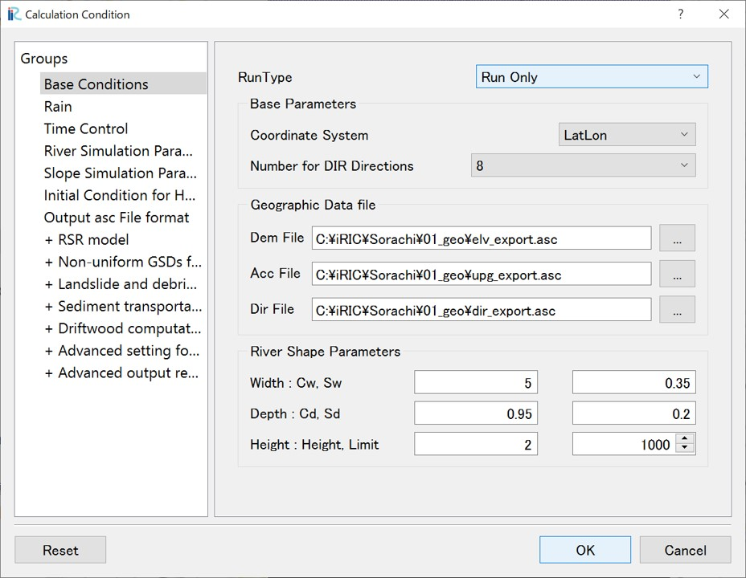
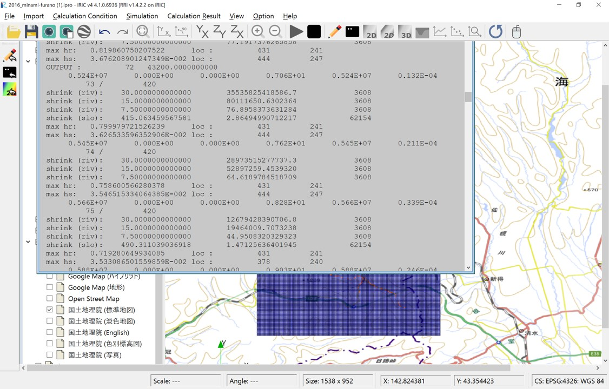

Example 1: Sorachi River, August 2016
==================================================
From August 29th to 31st, 2016, heavy rainfall caused a levee breach and river flooding in the Sorachi River. Details on the heavy rainfall and flooding conditions are described in the investigation report [1]_, and the paper [2]_ (we apologize, but those references are in Japanese.).

This section demonstrates the procedure for simulating the flooding in the Sorachi River basin during that event using RRI on iRIC.

.. [1] `2016 年 8 月北海道豪雨災害 調査団報告書, 土木学会災害調査団 <http://committees.jsce.or.jp/report/system/files/2016%E5%B9%B48%E6%9C%88%E5%8C%97%E6%B5%B7%E9%81%93%E8%B1%AA%E9%9B%A8%E5%9C%9F%E6%9C%A8%E5%AD%A6%E4%BC%9A%E8%AA%BF%E6%9F%BB%E5%9B%A3%E5%A0%B1%E5%91%8A%E6%9B%B8_20170501.pdf>`_ 
.. [2] `2016年8月北海道豪雨における空知川幾寅地区の氾濫被害に関する調査および要因検証, 土木学会論文集B1（水工学）Vol.73, No.4, I_1429-I_1434, 2017. <https://www.jstage.jst.go.jp/article/jscejhe/73/4/73_I_1429/_pdf>`_ 

-----

1. Sample data
--------------------------------------------------
The sample data used in this example can be downloaded from the following links:

- Terrain and rainfall dataset  → `data_1 <https://i-ric.org/uc/uc_products/rri_examples/data_1.7z>`_
- iRIC software project file 　→ `data_1_iRIC <https://i-ric.org/uc/uc_products/rri_examples/2016_minami_furano_.ipro>`_  

１．Preparation for the Basin Topographic Dataset
--------------------------------------------------
The basin topographic dataset is included in the data downloadable from "0. Sample Data".
(Please also refer to the section 'Overview 1.')
By using `UC tools <https://tools.i-ric.info/login/>`_, which is available to anyone upon registration, you can also easily obtain the data via the following method:

- [1] Access the tool `'Basin Data Extraction'  <https://tools.i-ric.info/login/>`_ 
- [2] Download the 3-second mesh MERIT Hydro data.
- [3] STEP 1: Zoom in on the Ikutora area of the Sorachi River and click on the downstream end of the target watershed.

   .. image:: img_1/step1_click2.jpg
        :width: 640px

- [4] STEP 2: Click the "Search" button, and the target watershed will be extracted.

    .. image:: img_1/step2_extract2.jpg
        :width: 640px

- [5] STEP 3: Click the "Download" button and download the extracted data to a suitable location.

-----

２．Preparation of Rainfall dataset
--------------------------------------------------
The rainfall dataset is included in the "data_1/02_rain" folder of the data downloadable from "0. Sample Data". 
This folder contains processed rainfall data for the target area and period, extracted from analyzed rainfall data. 
For details on analyzed rainfall data, please refer to the `Japan Meteorological Agency website <https://www.jma.go.jp/jma/kishou/know/kurashi/kaiseki.html#:~:text=%E8%A7%A3%E6%9E%90%E9%9B%A8%E9%87%8F%E3%81%A8%E9%80%9F%E5%A0%B1%E7%89%88,%E3%81%94%E3%81%A8%E3%81%AB%E4%BD%9C%E6%88%90%E3%81%95%E3%82%8C%E3%81%BE%E3%81%99%E3%80%82>`_ をご確認ください。

The rainfall data for each time step, indicated in the filename, is stored in a separate file in ASC format. 
The time is in UTC. Data in ASC format can be visualized and displayed in GIS.
"asc2raindat.py" is a Python script that creates a rainfall data file in the RRI format from the ASC format data in the folder. 
If you have a Python execution environment, you can use it. 
If you do not have a Python execution environment, a file "rain.dat", which has already been converted to the RRI rainfall data format, is also included.

You can also prepare rainfall data using `UC tools <https://tools.i-ric.info/login/>`_, which is available to anyone upon registration. For the detailed procedure, please refer to "2. Preparation for a rainfall dataset" in the Overview.

**<Data check>**

Time-series ASC format files can be visualized and checked on iRIC using the following procedure. 
The data imported here is not used for calculation. This function is only for visualization and confirmation.

- Launch iRIC and select RRI.
- Right-click on "Rain[mm/h]: Data Check Only" in the Object Browser and select "Import".
- Select one file in the folder where the time-series, ASC format rainfall data is stored, and click "Open".
- A screen will appear asking you to specify the coordinate system used for the file data. Click "OK".

   .. image:: img_1/set_coordinates_for_file2_en.jpg
        :width: 480px
        :align: center

- Select "EPSG:4326: WGS84" and click "OK".

   .. image:: img_1/set_coordinates_for_file_2_en.jpg
        :width: 480px
        :align: center

-  screen will appear again asking you to specify the coordinate system used for the file data. Click "OK".

   .. image:: img_1/set_coordinates_for_file_en.jpg
        :width: 480px
        :align: center

- Select "EPSG:4326: WGS84" again and click "OK".

   .. image:: img_1/set_coordinates_for_file_2_en.jpg
        :width: 480px
        :align: center

- iRIC assumes that the file name includes the date and time. Here, you specify the format. 
- If an appropriate date and time are displayed in the recognition result, click "OK."

   .. image:: img_1/set_datetime2_en.jpg
        :width: 480px
        :align: center

- A list of correctly recognized data will be displayed. Click "OK".

   .. image:: img_1/import_list2_en.jpg
        :width: 480px
        :align: center

- Import will begin. Once the import is complete, you can visualize the rainfall data as shown below. You can also check the time-series changes. It will be easier to check if you display map on the background image.

   .. image:: img_1/finish_import_data_en.jpg
        :width: 640px
        :align: center

-----

３．Calculation conditions
--------------------------------------------------

3.1 Creating and Verifying the Grid and Grid Attributes
~~~~~~~~~~~~~~~~~~~~~~~~~~~~~~
Go to "Grid > Select Grid Algorithm > RRI DEM and River Grid Creator" to launch it.

The "Grid Generation" dialog will open. Set the following conditions.

**"Terrain Data" tab**

.. figure:: img_1/rri_demAdjust2_main.jpg
   :scale: 50%
   :alt:

- Coordinate System: Lat/Lon
- DEM file: elv_export.asc
- DIR file: dir_export.asc
- ACC file: upg_export.asc

**"River Shape" tab**

.. figure:: img_1/rri_demAdjust2_river.jpg
   :scale: 50%
   :alt:

- River Channel Cell ACC Threshold: 100
- River Width: :math:`C_w=5, S_w=0.35`
- River Depth: :math:`C_d=0.95, S_d=0.2`
- Levee: Height [m] = 2, Minimum ACC for height setting = 1000

Click "Generate Grid(C)" to start processing.
When processing is complete, grids and grid attributes are automatically created.

Save the project in ipro format. From "File > Save as file (ipro)".

You can check the grid shape and the created cell attribute values in "Object Browser > Grid".

Grid Shape (293 × 481 = 140933)
    .. image:: img_1/ini_grid_en.jpg
        :width: 640px
        :align: center

Elevation [m]: Elevation value of each cell.
    .. image:: img_1/ini_elv_en.jpg
        :width: 640px
        :align: center

ACC: Number of upstream accumulated pixels for each cell. Multiplying this value by the cell area gives the upstream accumulation area (A).
    .. image:: img_1/ini_acc_en.jpg
        :width: 640px
        :align: center

DIR: Flow direction for each cell. East(1), South-East(2), South(4), South-West(8), West(16), North-West(32), North(64), North-East(128).
    .. image:: img_1/ini_dir_en.jpg
        :width: 640px
        :align: center

Width[m]　Width [m]: Channel width is set using the function  :math:`W = C_w A^{S_w}`, where A is the upstream accumulation area and the parameters are those specified.
    .. image:: img_1/ini_width_en.jpg
        :width: 640px
        :align: center

Depth [m]: Channel depth is set using the function :math:`D = C_d A^{S_d}`, where A is the upstream accumulation area and the parameters are those specified.
    .. image:: img_1/ini_depth_en.jpg
        :width: 640px
        :align: center

Height [m]: Levees are set at locations where the number of upstream accumulated pixels is greater than or equal to the Levee Cell Threshold, with a height specified by the Levee Height.
    .. image:: img_1/ini_height_en.jpg
        :width: 640px
        :align: center

-----

3.2 Rainfall conditions
~~~~~~~~~~~~~~~~~~~~~~~~~~~~~~
Use the "rain.dat" data file shown in "2. Preparation of Rainfall dataset" for the rainfall conditions. 
"rain.dat" contains rainfall data for the Hokkaido region from August 29, 2016, 0:00 UTC to August 31, 2016, 23:30 UTC (71.5 hours) at 30-minute intervals. 
You can check the details of the data by opening the ASC files with a text editor.

Open the calculation condition setting screen from "Calculation Condition > Setting", select "Group > Rain", and set the following:

.. list-table:: Rain
   :widths: 70 30
   :header-rows: 1

   * - Screen
     - Condition
   * - .. image:: img_1/cond_2_en.jpg
     - | Rain file: Specify the "rain.dat" file
     - | you downloaded as sample data.

     - | xllcorner_rain: 139
     - | yllcorner_rain: 41
     - | cellsize_rain_x: 0.0125
     - | cellsize_rain_y: 0.0083333
  
This completes the rainfall data settings.

-----

3.3 Time Control
~~~~~~~~~~~~~~~~~~~~~~~~~~~~~~
On the calculation condition setting screen, select "Group > Time Control" and set the following:

.. list-table:: Time Control
   :widths: 70 30
   :header-rows: 1

   * - Screen
     - Condition
   * - .. image:: img_1/cond_3_en.jpg
     - | Simulation Time [hour]: 70
       | Slope Calculation Time Step [sec]: 600
       | River Channel Calculation Time Step [sec]: 60
       | Number of Outputs: 70

-----

3.4 River Simulation Parameters
~~~~~~~~~~~~~~~~~~~~~~~~~~~~~~
Here, you specify the threshold value for identifying river channel cells and the Manning's roughness coefficient for cells identified as river channel cells.

.. list-table:: River Simulation Parameters
   :widths: 70 30
   :header-rows: 1

   * - Screen
     - Condition
   * - .. image:: img_1/cond_4_en.jpg
     - | Manning's Roughness Coefficient 
       | for River Channel: 0.03
       | River Channel Cell Threshold: 100

3.5 Slope Simulation Parameters
~~~~~~~~~~~~~~~~~~~~~~~~~~~~~~
Slope simulation parameters are set in relation to the cell attribute "Land Use Type". 
In this example, since "Land Use Type" is not specified at all, "Land Use Type" for all cells will be "Region1". 
Here, we will not consider subsurface infiltration or groundwater flow, so set the following:

.. list-table:: Slope Simulation Parameters
   :widths: 70 30
   :header-rows: 1

   * - Screen
     - Condition
   * - .. image:: img_1/cond_5_en.jpg
     - | Only parameters for Region1 are enabled.
       
       | Green-Ampt ...
       | ksv[m/s]: 0

       | lateral subsurface...
       | ka[m/s]: 0

       | Leave other parameters at their default.

-----

４．Run the calculation
--------------------------------------------------
On the calculation condition screen, set the execution mode in "Base Conditions" to "Run only". Click "Save and Close" to close the calculation condition setting screen.

:width: 480px
:align: center

Execute the calculation by clicking "Calculation > Run". 
Always you should save your data before running the calculation. 
When the calculation starts, the following screen will be displayed:

:width: 640px
:align: center

When the calculation is complete, a screen will appear indicating completion.

-----

５．Analyzing and Visualizing Calculation Results
--------------------------------------------------
Once the calculation has finished successfully, the visualization window becomes available. 

RRI on iRIC outputs the following values as calculation results:
================ =======================================================
Display Name       Meaning                               
================ =======================================================
total_qp_t[mm]   Total Rainfall [mm]                 
qp_t[mm/h]       Rainfall Intensity [mm/h]          
hs[m]            Inundation Depth on Slopes (including ground water) [m] 
Surface depth[m] Inundation Depth on Slopes (surface water only) [m]     
hr[m]            River Channel Water Depth [m]        
qr[m]            River Channel Discharge [m³/s]         
qu               Slope Discharge, x-direction [m/s]               
qv               Slope Discharge, y-direction [m/s]     
hg[m]            Groundwater Depth [m]                            
gu               Groundwater Flow, x-direction [m/s]       
gv               Groundwater Flow, y-direction [m/s]   
gampt_ff         Green-Ampt cumulative water depth [m]   
================ ======================================================= 

Using the functions of the iRIC software, you can examine the calculation results from various perspectives. 
The following are some visualization examples:

Total Rainfall: You can find that there are multiple locations where more than 500 mm of rain fell between August 29, 2016, 0:00 UTC and August 31, 2016, 22:00 UTC (70 hours).
    .. image:: img_1/res_sum_rain_en.png
        :width: 640px
        :align: center

River Channel Discharge (i=107, j=163): The peak discharge was approximately 1100 m³/s.
    .. image:: img_1/res_runoff.png
        :width: 640px
        :align: center

River Channel Water Depth and Inundation Depth on Slopes at Peak Time (August 31, 2016, 1:00)
    .. image:: img_1/res_depth.png
        :width: 640px
        :align: center

River Channel Water Depth and Inundation Depth on Slopes at Peak Time (August 31, 2016, 1:00) - Zoomed in on the urban area. You can see that flooding occurred in the urban area.
    .. image:: img_1/res_depth_2.png
        :width: 640px
        :align: center

-----

Summary
--------------------------------------------------
This section presented the workflow for using RRI on iRIC: preparing terrain and rainfall data, setting them as calculation conditions, running the calculation, and visualizing and confirming the calculation results.

Comparison of the obtained calculation results with the actual event is not performed here. We encourage you to try this yourself. We hope that you will deepen your understanding of the phenomena by adjusting parameters and recalculating as necessary.

