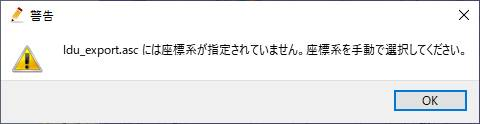
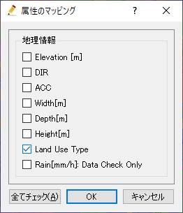
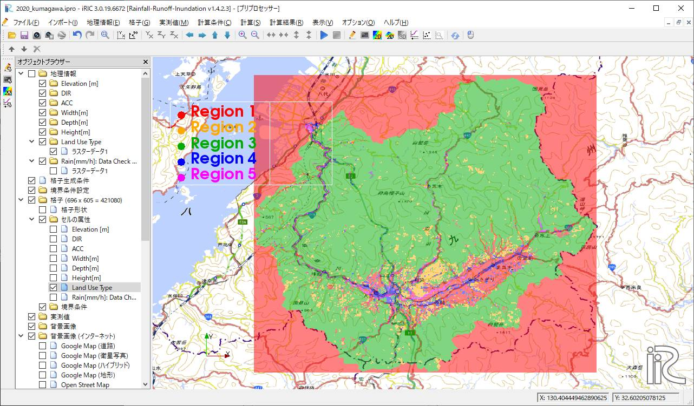

Example2：2020年7月 球磨川
==================================================
2020年7月3日から4日の大雨で球磨川流域人吉地区では大規模な河川氾濫が生じました。気象情報については [1]_ に詳しく記載されています。
ここでは、そのときの球磨川流域の状況をRRI on iRICでシミュレーションする手順を示します。

.. [1] `災害時気象資料　令和２年７月５日　熊本地方気象台 <https://www.jma-net.go.jp/fukuoka/chosa/saigai/20200705_kumamoto.pdf>`_ 
.. [2] `令和2年7月豪雨に関する情報　国土地理院 <https://www.gsi.go.jp/BOUSAI/R2_kyusyu_heavyrain_jul.html>`_ 

-----

0. サンプルデータ
--------------------------------------------------
この事例で利用するサンプルデータは以下からダウンロードすることができます。

- 地形および降雨データセット → `data_2 <https://uc.i-ric.org/uc_products/rri_examples/data_2.7z>`_  
- iRICソフトウェア用プロジェクトファイル　→ `data_2_iRIC <https://uc.i-ric.org/uc_products/rri_examples/2020_kumagawa.ipro>`_  

１．流域地形データセットの取得
--------------------------------------------------
流域地形データセットは、「0.サンプルデータ」でダウンロードできるデータの中に入っていますが、以下の方法でも取得することができます。

- [1]  `「流域データ抽出」  <https://tools.i-ric.info/login/>`_    にアクセスします
- [2] ここでは1秒メッシュであるMERIT Hydroのデータをダウンロードします。
- [3] STEP1 球磨川流域を拡大し、対象流域の下流端をクリックします。

   .. image:: img_2/step1_click2.jpg
        :width: 640px

- [4] STEP2 「検索」ボタンをクリックすると、対象流域が抽出されます。

    .. image:: img_2/step2_extract2.jpg
        :width: 640px

- [5] STEP3 「取得」ボタンをクリックし、抽出されたデータを適当な場所にダウンロードしてください。

-----

２．降雨データセットの作成
--------------------------------------------------
降雨データセット、「0.サンプルデータ」ダウンロードできるデータの"data_2/02_rain"の中に対象地域の対象期間の解析雨量を切り出したデータを格納しています。
解析雨量については、 `気象庁のホームページ <https://www.jma.go.jp/jma/kishou/know/kurashi/kaiseki.html#:~:text=%E8%A7%A3%E6%9E%90%E9%9B%A8%E9%87%8F%E3%81%A8%E9%80%9F%E5%A0%B1%E7%89%88,%E3%81%94%E3%81%A8%E3%81%AB%E4%BD%9C%E6%88%90%E3%81%95%E3%82%8C%E3%81%BE%E3%81%99%E3%80%82>`_ をご確認ください。

ファイル名に含まれる時刻の降雨データがそれぞれASC形式のファイルに格納されています。時刻はUTCです。なおASC形式のデータはGISで可視化表示することができます。

"asc2raindat.py"はフォルダに含まれるASC形式の複数のデータから、RRI用の降雨データ形式のファイルを作成するPythonスクリプトです。
Python実行環境がある方はそれを利用してみてください。Python実行環境がなくても、すでにRRI用の降雨データ形式に変換したファイル"rain.dat"も一緒に格納しています。

-----

３．計算条件設定
--------------------------------------------------

3.1 格子・格子属性の作成・確認
~~~~~~~~~~~~~~~~~~~~~~~~~~~~~~
「計算条件＞設定」から計算条件設定画面を開きます。「グループ＞基本条件」で以下のように条件を設定します。

.. list-table:: 基本条件グループ
   :widths: 70 30
   :header-rows: 1

   * - 画面
     - 条件
   * - .. image:: img_2/cond_1.jpg
     - | モード：「格子・格子属性生成」
       
       | データファイル設定
       |  - DEM: 水文補正標高(elv_export.asc)
       |  - Acc: 上流集水グリッド数(upg_export.asc)
       |  - Dir: 表面流向データ(dir_export.asc)

       | 河道形状をパラメータ-
       |  - :math:`C_w=5, S_w=0.35`
       |  - :math:`C_d=0.95, S_d=0.2`
       |  - 堤防高[m]=2, 堤防セル閾値=1000

「保存して閉じる」をクリックし、「計算＞実行」をクリックします。

プロジェクトを保存し、「ファイル＞開く」から再度プロジェクトを開いてください。

「オブジェクトブラウザ＞格子」の格子形状、および、セル属性で作成された値を確認することができます。

格子形状（696×605=421080）
    .. image:: img_2/ini_grid.jpg
        :width: 640px
        :align: center

Elevation[m] 各セルの標高値です。
    .. image:: img_2/ini_elv.jpg
        :width: 640px
        :align: center

ACC　各セルの上流集水ピクセル数です。セル面積を乗じると上流集水面積:Aになります。
    .. image:: img_2/ini_acc.jpg
        :width: 640px
        :align: center

DIR　各セルの流向です。East(1),South-East(2),South(4),South-West(8),West(16),North-West(32),North(64),North-East(128)。
    .. image:: img_2/ini_dir.jpg
        :width: 640px
        :align: center

Width[m]　上流集水面積:Aと指定したパラメータによる関数 :math:`W = C_w A^{S_w}` で河道幅が設定されています。
    .. image:: img_2/ini_width.jpg
        :width: 640px
        :align: center

Depth[m]　上流集水面積:Aと指定したパラメータによる関数 :math:`D = C_d A^{S_d}` で河道深が設定されています。
    .. image:: img_2/ini_depth.jpg
        :width: 640px
        :align: center

Height[m]　上流集水ピクセル数が堤防セル閾値以上の箇所に、堤防高で指定された堤防が設定されています。
    .. image:: img_2/ini_height.jpg
        :width: 640px
        :align: center

-----

3.2 降雨条件の設定
~~~~~~~~~~~~~~~~~~~~~~~~~~~~~~
降雨条件は、「2.降雨データセットの作成」で示したデータ"rain.dat"を利用します。
"rain.dat"には、2020年7月3日 0:00UTCから2020年7月4日 3:00UTC（27時間分）の九州付近の降雨データが30分間隔で格納されています。
ASCファイルをテキストエディタで開くことで、データ詳細を確認することができます。

「計算条件＞設定」で計算条件設定画面を表示し、「グループ＞降雨データ」を選択し、以下のように設定します。

.. list-table:: 降雨データ　グループ
   :widths: 70 30
   :header-rows: 1

   * - 画面
     - 条件
   * - .. image:: img_2/cond_2.jpg
     - | 降雨データファイル：サンプルデータとして
       | ダウンロードした"rain.dat"を指定します。
       
       | xllcorner_rain:129
       | yllcorner_rain:30
       | cellsize_rain_x:0.0125
       | cellsize_rain_y:0.0083333

以上で降雨データを設定は完了です。

-----

3.3 計算時間の設定
~~~~~~~~~~~~~~~~~~~~~~~~~~~~~~
計算条件設定画面で、「グループ＞時間管理」を選択し、以下のように設定します。

.. list-table:: 時間管理　グループ
   :widths: 70 30
   :header-rows: 1

   * - 画面
     - 条件
   * - .. image:: img_2/cond_3.jpg
     - | シミュレーション時間[hour]：27
       | 斜面計算タイムステップ[sec]：600
       | 河道計算タイムステップ[sec]：60
       | 出力回数：27

-----

3.4 河道シミュレーション設定
~~~~~~~~~~~~~~~~~~~~~~~~~~~~~~
ここでは、河道セルの判定値と河道セルと認識されたセルのマニング粗度係数を指定します。

.. list-table:: 河道シミュレーション　グループ
   :widths: 70 30
   :header-rows: 1

   * - 画面
     - 条件
   * - .. image:: img_2/cond_4.jpg
     - | 河道のマニング粗度係数：0.03
       | 河道セル判定閾値：100

-----

3.5 斜面シミュレーション設定
~~~~~~~~~~~~~~~~~~~~~~~~~~~~~~
斜面シミュレーションは、セル属性"Land Use Type"と関連してパラメータ設定を行います。
まずダウンロードした地形データセットの"ldu_export.asc"を利用して、セル属性を設定します。

「オブジェクトブラウザー＞Land Use Type」、インポートをクリックし、ラスタデータを選択します。
"ldu_export.asc"を選択し、「開く」をクリックします。
座標系を指定する画面が表示されるので「OK」をクリックし、"EPSG:4326: WGS84"を指定し「OK」をクリックします。

インポートすると以下のようにデータを確認することができます。

本土地利用区分データは佐山氏らが参考値として作成したもので、なんら正確性が保証されたものではありません。
が、本事例ではこのデータを利用して計算することにします。

.. image:: img_2/ldu_import.jpg
        :width: 640px
        :align: center

各領域の土地利用区分は以下のようです。

============== ==========================================
Region           土地利用区分
============== ==========================================
Region1         水田
Region2         畑地
Region3         山地
Region4         都市
Region5         水域
============== ==========================================

ここまでの操作では、「地理情報」に土地利用データを読み込んだに過ぎず、計算に利用される格子属性としての土地利用データが作成されていません。
「格子＞属性マッピング＞実行」をクリックします。マッピング属性を選択する画面が表示されます。
"Land Use Type"のみを選択し、「OK」ボタンをクリックしてください。

.. note::
    マッピング処理は、地理情報から格子属性を作成する処理になります。
    「オブジェクトブラウザ＞地理情報」下に読み込まれているデータが、格子形状に応じてマッピングされます。
    逆に、「オブジェクトブラウザ＞地理情報」下に何もデータが読み込まれていない場合は、既存格子属性がすべて削除されます。

マッピングが完了すると、「格子＞セル属性＞Land Use Type」をチェックすることで格子属性を確認することができます。

計算条件設定画面で「グループ＞斜面シミュレーション設定」を選択します。
1から5の土地利用区分を踏まえ、地下浸透、地下水流れに係るパラメータを以下のように設定します。
Region1からResion5すべてのパラメータが有効になります。

.. image:: img_2/cond_5.jpg
        :width: 640px
        :align: center

-----

４．計算実行
--------------------------------------------------
計算条件画面で、「基本条件」の実行モードを「計算実行」にします。
「保存して閉じる」で、計算条件設定画面を閉じます。

.. image:: img_2/cond_0.jpg
        :width: 480px
        :align: center

「計算＞実行」から計算を実行してください。
計算実行前には必ず、データを保存してください。
計算が開始されると以下の画面が表示されます。

.. image:: img_2/calc_status.jpg
        :width: 640px
        :align: center

計算が終了すると、終了を知らせる画面が表示されます。

-----

５．計算結果分析・可視化
--------------------------------------------------
計算が正常に終了すると、可視化ウィンドウの表示が可能となります。
RRI on iRICは以下の値を計算結果として出力しています。

============== ========================================== ======
表示名            意味                                      補足
============== ========================================== ======
total_qp_t[mm]  総雨量[mm]                                  1
qp_t[mm/h]      雨量強度[mm/h]                              1
hs[m]           氾濫原水深[m]                               1
hr[m]           河道水深[m]                                 1 
qr[m]           河道流量[m3/s]                              1
qu              斜面流量x方向[m/s]                          1
qv              斜面流量y方向[m/s]                          1
hg[m]           地下水深[m]                                 1
gu              地下流量x方向[m/s]                          1
gv              地下流量y方向[m/s]                          1
gampt_ff        Green-Ampt cumulative water depth [m]      1
============== ========================================== ======

iRICソフトウェアの基本機能を利用して、様々な角度から計算結果を確認することができます。
以下に可視化例を表示します。

流域総雨量：2020年7月3日 0:00-4日 3:00UTC（2020年7月3日 9:00-4日 12:00JST)の27時間でに700mm以上降った箇所が複数地点あることが確認できます
    .. image:: img_2/res_sum_rain.png
        :width: 640px
        :align: center

氾濫被害が生じた人吉地区 紅取橋付近の河道流出流量（i=219, j=169)　ピーク流量は800m3/s程度であったという結果でした。
    .. image:: img_2/res_runoff.png
        :width: 640px
        :align: center

ピーク時（2020年7月4日 10:00時）の河道水深と斜面水深
    .. image:: img_2/res_depth.png
        :width: 640px
        :align: center

ピーク時（2020年7月4日 10:00時）の河道水深と斜面水深　市街地部分を拡大。市街地部分で氾濫が生じている様子が確認できます。
    .. image:: img_2/res_depth_2.png
        :width: 640px
        :align: center

-----

まとめ
--------------------------------------------------
ここではRRI on iRICの使い方として、地形と降雨データを準備、それらを計算条件として設定し、計算を実行し、計算結果を可視化、確認する流れを紹介しました。
得られた計算結果と実現象との比較は、ここでは行いません。各自実践してみてください。
必要に応じて、パラメータを調整し再計算するなどして、現象に対する理解を深めていただければと思います。

