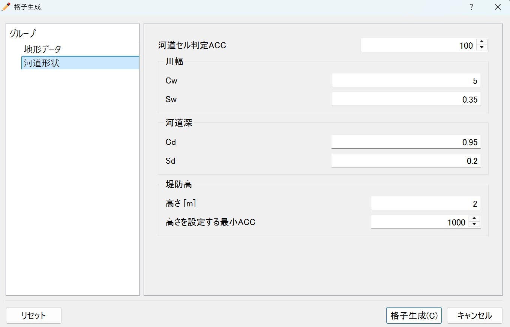
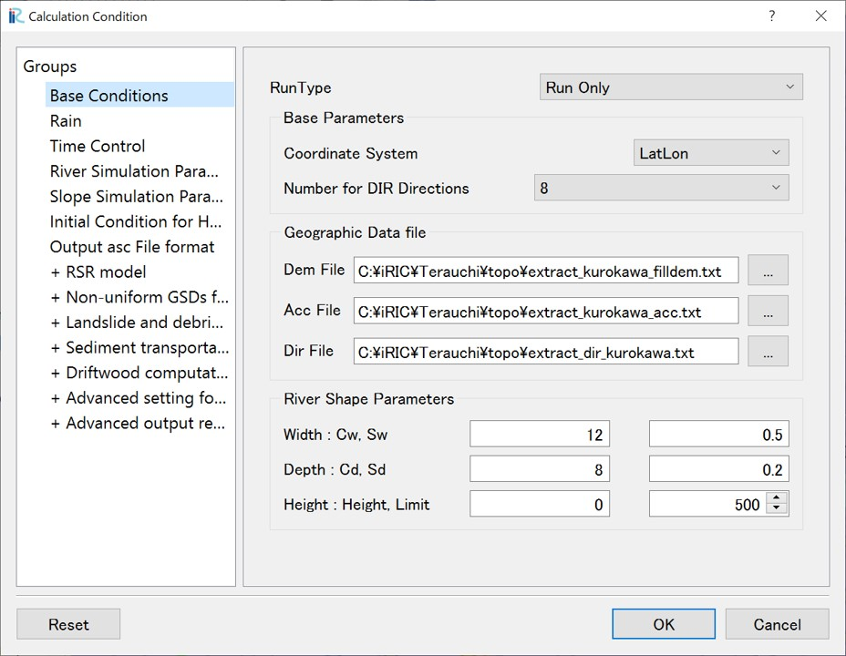
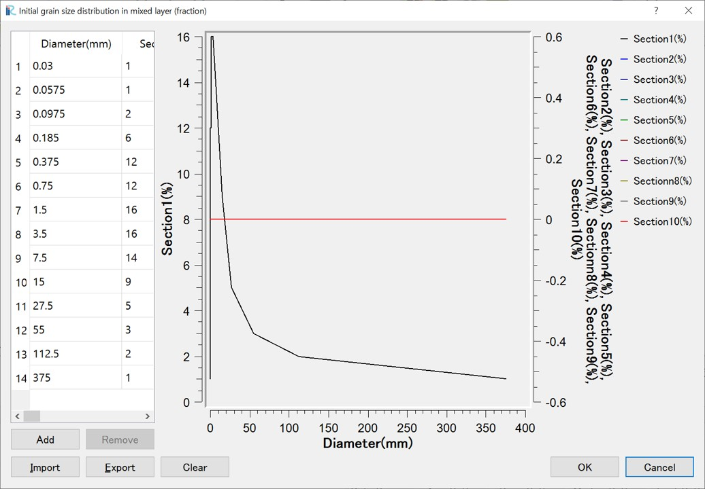
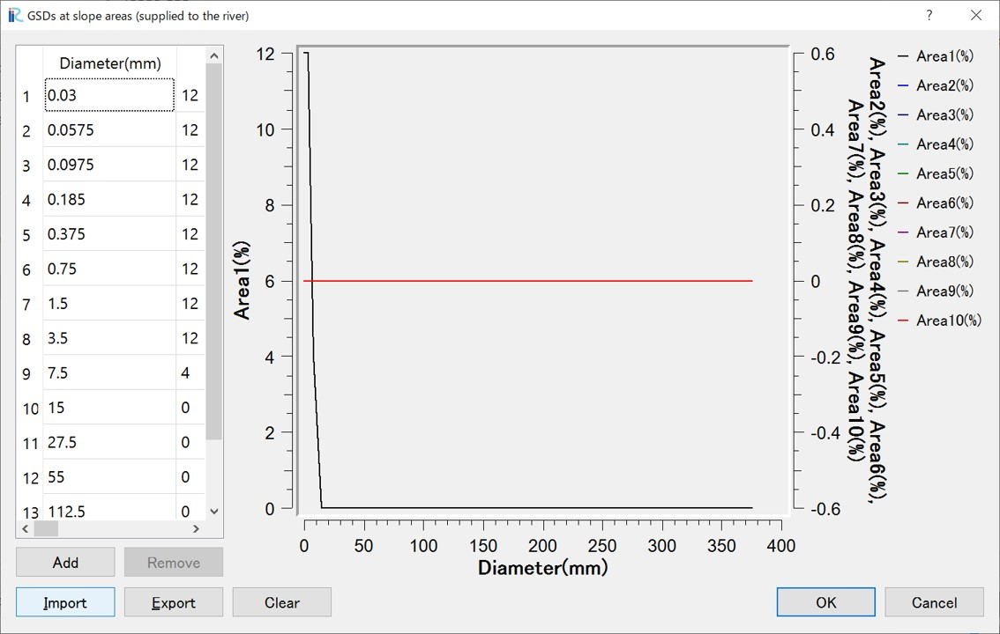

Example 2：(RSR model) Kurokawa river, July 2017
==================================================
From July 5, 2017, heavy rainfall (the July 2017 Northern Kyushu Heavy Rain) caused numerous flood inundation with a large amount of sediment and driftwood in Asakura City, Fukuoka Prefecture, resulting in significant damage. 
This example demonstrates the procedure for applying the RSR model to the Terauchi Dam basin, located in the upper reaches of the Sada River, a tributary of the Chikugo River system, referencing the analysis results in [1]_.  (we apologize that the reference is in Japanese at this moment.).
This example alanlyze a sub-basin of the Sada River, the Kurokawa River basin (catchment area approximately 12.8 km²).

.. [1] `原田大輔, 江頭進治, 秦梦露. (2024). 降雨-土砂・流木流出モデルの特性-土砂粒度分布と流木の時空間変化に着目して. 河川技術論文集, 30, 335-340. <https://www.jstage.jst.go.jp/article/river/30/0/30_335/_article/-char/ja/>`_ 
-----

0. Sample data
--------------------------------------------------
The sample data used in this example can be downloaded from the following links:

- Terrain, rainfall, and sediment dataset → `data_2 <https://i-ric.org/uc/uc_products/rri_examples/Terauchi_data.zip>`_
- iRIC software project file →  `data_2_iRIC <https://i-ric.org/uc/uc_products/rri_examples/2017_kurokawa.ipro>`_  

-----

１．Creating the Watershed Topographic Dataset
--------------------------------------------------
This analysis involves landslide and debris flow calculations, requiring the creation of a watershed topographic dataset using a fine mesh size, such as 10m. 
The watershed topographic dataset consists of elevation data (DEM), the number of accumulated upslope cells (ACC), and the flow direction (DIR), and the creation method is described in Chapter 3 of the RRI manual and elsewhere. 
The watershed topographic dataset for this example is included in the data downloadable from "0. Sample Data," and the creation method is as follows:

- [1] Within Japan, 10m mesh elevation data (DEM) can be downloaded from the Geospatial Information Authority of Japan's Fundamental Geospatial Data (Digital Elevation Model). You can also obtain high-resolution terrain data from `ASTER GDEM <https://www.jspacesystems.or.jp/ersdac/GDEM/E/1.html>`_
- [2] Using hydrological analysis tools such as Arc Hydro tools, perform filling (Fill DEM) on the DEM elevation data, then extract the watershed and create the number of accumulated upslope cells (ACC) and flow direction (DIR).
- [3] Store the created data (DEM, ACC, DIR) in a suitable location.
-----

２．Creating the Rainfall Dataset
--------------------------------------------------
The rainfall dataset is included in the "data_3/02_rain" folder of the data downloadable from "0. Sample Data". This folder contains processed rainfall data for the target area and period, extracted from analyzed rainfall data. 
For details on analyzed rainfall data, please refer to the  `Japan Meteorological Agency website <https://www.jma.go.jp/jma/kishou/know/kurashi/kaiseki.html#:~:text=%E8%A7%A3%E6%9E%90%E9%9B%A8%E9%87%8F%E3%81%A8%E9%80%9F%E5%A0%B1%E7%89%88,%E3%81%94%E3%81%A8%E3%81%AB%E4%BD%9C%E6%88%90%E3%81%95%E3%82%8C%E3%81%BE%E3%81%99%E3%80%82>`_

For this example, the file "rain.dat", which has already been converted to the RRI rainfall data format, is provided. 
By using `UC tools <https://tools.i-ric.info/login/>`_, which is available to anyone upon registration, you can also easily create rainfall data files ("rain.dat").

-----

３．Calculation condition (Flow only)
--------------------------------------------------

3.1 Creating and Verifying the Grid and Grid Attributes
~~~~~~~~~~~~~~~~~~~~~~~~~~~~~~
Go to "Grid > Select Grid Algorithm > RRI DEM and River Grid Creator" to launch it.

When performing sediment calculations, the channel width is an important parameter for evaluating bed shear stress, so set it to correspond to the actual conditions in the field.
Also, in this calculation, the parameters related to channel depth (`Cd`) are set to large values to prevent the river channel from being completely filled with sediment.

The "Grid Generation" dialog will open. Set the following conditions.

**"Terrain Data" tab**

.. figure:: img_2/rri_demAdjust2_main.jpg
   :scale: 50%
   :alt:

- Coordinate System: Lat/Lon
- DEM file: filldem.txt
- DIR file: dir_kurokawa.txt
- ACC file: acc.txt

**"River Shape" tab**

- River Channel Cell ACC Threshold: 500
- River Width: :math:`C_w=12, S_w=0.5`
- River Depth: :math:`C_d=8, S_d=0.2`
- Levee: Height [m] = 0, Minimum ACC for height setting = 500

Click "Generate Grid(C)" to start processing.
When processing is complete, grids and grid attributes are automatically created.

Save the project and open it from "File > Open".

You can check the grid shape and the created cell attribute values in "Object Browser > Grid".

To display the map, set the coordinate system from "File > Propaty > Coordinate System" and select "WGS84" or a similar system. 

Check the "Cell Attributes" box to display each information type.

Grid Shape (532 × 414 = 220248)

Elevation (DEM) [m]: Elevation value of each cell.
    .. image:: img_2/ini_elv.jpg
        :width: 640px
        :align: center

Accumulated Cell Count (ACC): Number of upstream accumulated pixels for each cell. Multiplying this value by the cell area gives the upstream accumulation area (A).
    .. image:: img_2/ini_acc.jpg
        :width: 640px
        :align: center

Flow Direction (DIR): Flow direction for each cell. East(1), South-East(2), South(4), South-West(8), West(16), North-West(32), North(64), North-East(128).
    .. image:: img_2/ini_dir.jpg
        :width: 640px
        :align: center

Channel Width [m]: Channel width is set using the function  :math:`W = C_w A^{S_w}`, where A is the upstream accumulation area and the parameters are those specified.
    .. image:: img_2/ini_width.jpg
        :width: 640px
        :align: center

Channel Depth [m]: Channel depth is set using the function :math:`D = C_d A^{S_d}`, where A is the upstream accumulation area and the parameters are those specified.

Other set parameters, such as Levee Height (m), can also be confirmed here. If you map land use, rainfall distribution set in 3.2, rainfall (mm/h), and grain size distribution (area) set on slopes and river channels as cell attributes, you can also check them here.

-----

3.2 Setting Rainfall 
~~~~~~~~~~~~~~~~~~~~~~~~~~~~~~
Use the "rain.dat" data file shown in "2. Creating the Rainfall Dataset" for the rainfall conditions.

Open the calculation condition setting screen from "Calculation Condition > Setting", select "Group > Rain", and set the following:

.. list-table:: Rainfall
   :widths: 70 30
   :header-rows: 1

   * - Screen
     - Condition
   * - .. image:: img_2/cond_2.jpg
     - | Rain file: Specify the "rain.dat" file
       | downloaded as sample data.
       
       | xllcorner_rain:130
       | yllcorner_rain:33.33
       | cellsize_rain_x:0.0125
       | cellsize_rain_y:0.0083333

This completes the rainfall data settings.

-----

3.3 Time Control
~~~~~~~~~~~~~~~~~~~~~~~~~~~~~~
On the calculation condition setting screen, select "Group > Time Control" and set the following:  
This time, to shorten the calculation time, the analysis is performed only for the 13 hours around the peak rainfall time.

.. list-table:: Time Control
   :widths: 70 30
   :header-rows: 1

   * - Screen
     - Condition
   * - .. image:: img_2/cond_3.jpg
     - | Simulation Time [hour]: 13
       | Time Step for Slope Simulation [sec]: 600
       | Time Step for River Simulation [sec]: 60
       | Number for Output Times: 13

-----

3.4 River Simulation Parameters
~~~~~~~~~~~~~~~~~~~~~~~~~~~~~~
Here, specify the threshold value for identifying river channel cells and the Manning's roughness coefficient for cells identified as river channel cells.

The smaller the threshold value for identifying river channel cells, the further upstream the river channel (where bed load and suspended load calculations are performed) will be considered, making this threshold value as a kind of parameter.

.. list-table:: River Simulation Parameters
   :widths: 70 30
   :header-rows: 1

   * - Screen
     - Condition
   * - .. image:: img_2/cond_4.jpg
     - | Manning Roughness for River Region：0.03
       | threshold of flow accumulation：500

-----

3.5 Slope Simulation Parameters
~~~~~~~~~~~~~~~~~~~~~~~~~~~~~~
Slope simulation parameters are set in relation to the cell attribute "Land Use Type". In this example, since "Land Use Type" is not specified, "Land Use Type" for all cells will be "Region1". 
Here, the parameters are adjusted for the inflow to the Terauchi Dam, and are set as follows:

.. list-table:: Slope Simulation Parameters
   :widths: 70 30
   :header-rows: 1

   * - Screen
     - Condition
   * - .. image:: img_2/cond_5.jpg
     - | Only parameters for Region1 are enabled.

       | Manning's Roughness for Slope: 0.4
       | Soil Layer Thickness (m): 0.7
       | Void Ratio: 0.471

       | ksv[m/s]: 0

       | ka[m/s]: 0.06
       | Unsat.porosity: 0.1
       | beta: 8

-----

4．Run Calculation (Flow only)
--------------------------------------------------
Before conducting sediment calculations, it is recommended to run a flow-only calculation first to verify that the calculation conditions are set correctly and to perform calibration. 
In this example, the parameters used have been calibrated for water runoff for the entire Terauchi Dam basin.

On the calculation condition screen, set the execution mode in "Base Conditions" to "Run only". Click "OK" to close the calculation condition setting screen.

Execute the calculation by clicking "Calculation > Run".

**Always save your data before running the calculation.** 

On a typical desktop computer, the calculation time is about 5-10 minutes. When the calculation is complete, a screen will appear indicating completion.

５．Visualizing Calculation Results (Before Sediment Calculation)
--------------------------------------------------
Once the calculation has finished successfully, the visualization window becomes available. 
Even before conducting sediment calculations, you can check the following items:

================ =======================================================
Display Name       Meaning                               
================ =======================================================
total_qp_t[mm]   Total Rainfall [mm]                 
qp_t[mm/h]       Rainfall Intensity [mm/h]          
hs[m]            Inundation Depth on Slopes (including ground water) [m] 
Surface depth[m] Inundation Depth on Slopes (surface water only) [m]     
hr[m]            River Channel Water Depth [m]        
qr[m]            River Channel Discharge [m³/s]         
qu               Slope Discharge, x-direction [m/s]               
qv               Slope Discharge, y-direction [m/s]     
hg[m]            Groundwater Depth [m]                            
gu               Groundwater Flow, x-direction [m/s]       
gv               Groundwater Flow, y-direction [m/s]   
gampt_ff         Green-Ampt cumulative water depth [m]   
================ ======================================================= 

Using the functions of the iRIC software, you can examine the calculation results from various perspectives. The following are some visualization examples:

Total Rainfall: You can check the spatial distribution of the total rainfall amount from the analyzed rainfall over the calculation time (13 hours).
    .. image:: img_2/sum_rain.png
        :width: 640px
        :align: center

Open a new graph window, select the "Calculation Result" tab, set "Glid Location: Cell center", add qr(m_s), and press OK. 
In the graph window, use the "Controller" below to select the coordinates of the downstream end of the Kurokawa River (near the confluence with the Sada River) (I=41, J=410) and you can check the discharge hydrograph.
    .. image:: img_2/res_runoff.png
        :width: 640px
        :align: center

-----

６．Calculation Condition for RSR model
--------------------------------------------------

6.1 Basic Settings for the Sediment Runoff (RSR) Model
~~~~~~~~~~~~~~~~~~~~~~~~~~~~~~
Open the calculation condition setting screen from "Calculation Condition > Setting".  Under "+ RSR Model", set the conditions related to sediment runoff.

.. list-table:: RSR Model
   :widths: 70 30
   :header-rows: 1

   * - Screen
     - Condition
   * - .. image:: img_2/cond_6.jpg
     - | Sediment computation (RSR): "Unit channel model"

       |  - Start time of bed deformation (hour): 2
       |  - Bed material type: Non-uniform
       |  - iidt (= dt_river/dt_sediment cal.): 1000
       |  - Bedload transport formula
       |  - Suspended sediment erosion formula

To shorten the calculation time, sediment analysis is not performed during the period after the start of the calculation when there is no rainfall (2 hours here). 
For the time step for riverbed variation calculation, set how many times sediment calculations are performed within one calculation time interval of the river channel in the RRI model. 
When dealing with suspended sediment, a smaller time step (larger value here) will improve calculation stability. However, a larger value will increase calculation time.

6.2 Detailed Settings for the RSR Model
~~~~~~~~~~~~~~~~~~~~~~~~~~~~~~
Next, configure the detailed settings. For the most part, the default values for the detailed settings are used, however, the maximum erosion depth for each unit river channel, the minimum unit river channel slope, and maximum unit river channel slope are parameters that need to be set carefully. 
Here, the maximum erosion depth is set to 3m, and the minimum unit river channel slope is set to 0.00005.

.. list-table:: Detailed Settings for the RSR Model
   :widths: 70 30
   :header-rows: 1

   * - Screen
     - Condition
   * - .. image:: img_2/cond_7.jpg
     - | - Maximum Erosion Depth (m): 3
     - | - Minimum Unit River Channel Slope：0.00005

      
6.3 Non-uniform Grain size distributions for river and slope
~~~~~~~~~~~~~~~~~~~~~~~~~~~~~~
When you emplloy non-uniform sediment, set the conditions related to the grain size distribution here. Click "Edit" for "Initial grain size distribution in mixed layer (fraction)" to open it. 
The grain size distribution used in this case is included in the data downloadable from "0. Sample Data". Click "Import" at the bottom of the screen and import the `sed_bed.csv` file.

Also, to provide the grain size distribution of sediment flowing into the river channel due to debris flows, set "GSD for slope area", click "Edit" for "GSDs at slope areas (supplied to the river)". 
The grain size distribution used in this case is included in the data downloadable from "0. Sample Data". Click "Import" at the bottom of the screen and import the `sed_debris.csv` file.

6.4 Landslide and debris flow
~~~~~~~~~~~~~~~~~~~~~~~~~~~~~~
When conducting landslide and debris flow analysis, open "+ Landslides and Debris Flows" and set the conditions.

.. list-table:: +Landslide and debris flow
   :widths: 70 30
   :header-rows: 1

   * - Screen
     - Condition
   * - .. image:: img_2/cond_8.jpg
     - | - Landslide and Debris Flow Computation: Enabled

       |  - cohesion(KN/m2): 1.5
       |  - Critical volume water content for subsurface flow：0.1
       |  - Fine material content in the debris flow：0.3
       |  - Width of debris flow (m):10
       |  - Erosion depth of debris flow (m):1
       |  - Exclude landslides below this rainfall (mm):10  
     

6.5 Driftwood computation
~~~~~~~~~~~~~~~~~~~~~~~~~~~~~~
When conducting driftwood analysis, open "+ Driftwood Calculation" and set the conditions.

.. list-table:: +Driftwood
   :widths: 70 30
   :header-rows: 1

   * - Screen
     - Condition
   * - .. image:: img_2/cond_9.jpg
     - | - Driftwood Computation: Enabled

       |  - Density of Standing Trees (m³/m²): 0.1

6.6 Running the Calculation
~~~~~~~~~~~~~~~~~~~~~~~~~~~~~~
After setting the sediment and driftwood analysis conditions, run the calculation.

Click "Calculation > Run" to execute the calculation.  
Always save your data before running the calculation.  
On a typical desktop computer, the calculation time is about 10-15 minutes. 
When the calculation is complete, a screen will appear indicating completion.

-----

７．Analyzing and Visualizing Calculation Results (with RSR model)
--------------------------------------------------
Once the calculation has finished successfully, the visualization window becomes available. You can check the following items:

===================================== ==========================================================
Display name                            Meaning                                   
===================================== ==========================================================
Bedload transport rate                Bed load transport rate (m³/s)
Suspended sediment transport rate     Suspended sediment transport rate (m³/s)
Elevation change (m)                  Riverbed elevation change (m)
Total bedload transport(m3)           Total bed load transport volume (m³)
Total S.S. transport(m3)              Total suspended sediment transport volume (m³)
Mean diameter(mm)                     Mean grain size of riverbed material (surface layer) (mm)
Land slide Occurrence                 Landslide occurrence (indicate 1 where landslides occur)
Elevation change (debris flow)(m)     Erosion and deposition due to debris flows (m)
Total sediment supply (debris flow)   Sediment supply to the river channel from debris flows
Wood_deposition(m3/m2)                Driftwood deposition amount per unit area (m³/m²)
Wood_concentration                    Driftwood concentration
===================================== =========================================================

Using the basic functions of the iRIC software, you can examine the calculation results from various perspectives. The following are some examples:

Bedload transport rate：You can check the spatial distribution of the bed load transport rate.
    .. image:: img_2/bedload.png
        :width: 640px
        :align: center

Elevation change：You can check the spatial distribution of erosion and deposition in the river channel.
    .. image:: img_2/elv_change.png
        :width: 640px
        :align: center

Land slide occurence：You can check the spatial distribution of landslide occurrence cells. Landslide occurrence locations are indicated as 1.
    .. image:: img_2/landslide.png
        :width: 640px
        :align: center
        
Elevation change (debris flow)：ou can check the spatial distribution of erosion and deposition due to debris flows.  
By overlaying this with the "Landslide occurrence cells" above, you can confirm that debris flows are analyzed along the steepest descent direction from the landslide initiation points.
    .. image:: img_2/debris.png
        :width: 640px
        :align: center

Wood_deposition(m3/m2) ：ou can check the spatial distribution of driftwood deposition per unit area.
    .. image:: img_2/wood.png
        :width: 640px
        :align: center        

-----

Summary
--------------------------------------------------
This section presented the workflow for setting up calculations, running, and visualizing results for the RSR model, using the Kurokawa River during the July 2017 Northern Kyushu Heavy Rain as an example. 
For verification of the analysis results, please refer to reference [1]_. 
We hope that you will deepen your understanding by adjusting parameters and recalculating as necessary.
