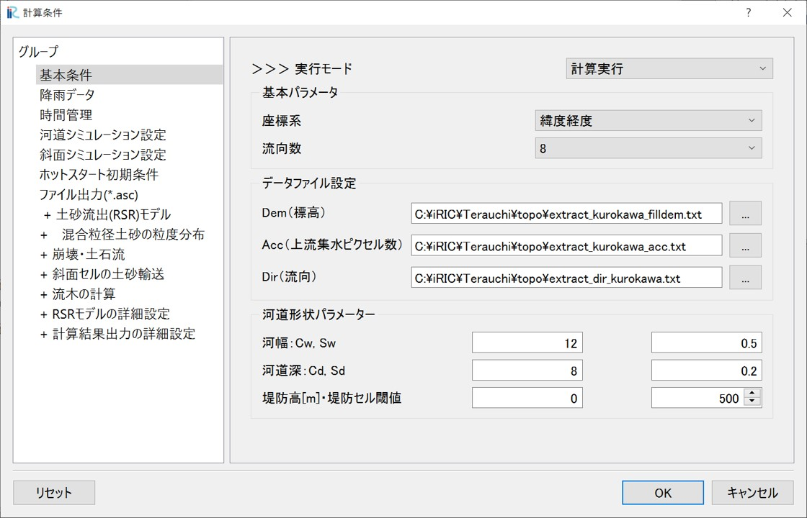

Example3：(RSRモデル) 2017年7月 黒川
==================================================
2017年7月5日からの大雨（九州北部豪雨）で、福岡県朝倉市ではいわゆる土砂・洪水氾濫が多数発生し、大きな被害を受けました。
筑後川水系佐田川の上流域の寺内ダム流域にRSRモデルを適用して解析した結果 [1]_ について、
ここでは佐田川流域の支川黒川（流域面積約12.8km²）を抽出して適用した事例を用いて、解析の手順を説明します。

.. [1] `原田大輔, 江頭進治, 秦梦露. (2024). 降雨-土砂・流木流出モデルの特性-土砂粒度分布と流木の時空間変化に着目して. 河川技術論文集, 30, 335-340. <https://www.jstage.jst.go.jp/article/river/30/0/30_335/_article/-char/ja/>`_ 
-----

0. サンプルデータ
--------------------------------------------------
この事例で利用するサンプルデータは以下からダウンロードすることができます。

- 地形および降雨データセット → `data_3 <https://uc.i-ric.org/uc_products/rri_examples/Terauchi_data.zip>`_ 
- iRICソフトウェア用プロジェクトファイル　→ `data_3_iRIC <https://uc.i-ric.org/uc_products/rri_examples/2017_kurokawa.ipro>`_  

１．流域地形データセットの作成
--------------------------------------------------
本解析では、崩壊・土石流の解析を行うため、10mメッシュ等の細かいメッシュを用いて流域地形データセットを作成します。
流域地形データセットは標高データ（DEM）、集水ピクセル数（ACC）、落水方向（DIR）から構成され、その作成方法はRRIマニュアルの第３章等に記載されています。
本解析例の流域地形データセットは、「0.サンプルデータ」でダウンロードできるデータの中に入っており、作成方法は以下の通りです。

- [1] 日本国内であれば、国土地理院の基盤地図情報（数値標高モデル）から10mメッシュの標高データ（DEM）をダウンロードできます。また、`ASTER GDEM <https://www.jspacesystems.or.jp/ersdac/GDEM/E/1.html>`_ でも高解像度の地形データを入手することができます。
- [2] Arc Hydroなどの水文解析ツールを用いて、DEMの標高データの窪地処理（Fill DEM）を実行した後、流域を抽出して、集水ピクセル数（ACC）、落水方向（DIR）を作成します。
- [3] 作成したデータ（DEM, ACC, DIR）を適当な場所に格納してください。

-----

２．降雨データセットの作成
--------------------------------------------------
降雨データセット、「0.サンプルデータ」ダウンロードできるデータの"data_3/02_rain"の中に対象地域の対象期間の解析雨量を切り出したデータを格納しています。
解析雨量については、 `気象庁のホームページ <https://www.jma.go.jp/jma/kishou/know/kurashi/kaiseki.html#:~:text=%E8%A7%A3%E6%9E%90%E9%9B%A8%E9%87%8F%E3%81%A8%E9%80%9F%E5%A0%B1%E7%89%88,%E3%81%94%E3%81%A8%E3%81%AB%E4%BD%9C%E6%88%90%E3%81%95%E3%82%8C%E3%81%BE%E3%81%99%E3%80%82>`_ をご確認ください。

本解析事例では、解析雨量データをRRI用の降雨データ形式に変換したファイル"rain.dat"を格納しています。
（一社）iRIC-UCの会員は、　`UC tools <https://tools.i-ric.info/login/>`を利用して雨量データファイル"rain.dat"を作成することができます。（旭さんに要確認）

-----

３．計算条件設定(水のみ)
--------------------------------------------------

3.1 格子・格子属性の作成・確認
~~~~~~~~~~~~~~~~~~~~~~~~~~~~~~
「計算条件＞設定」から計算条件設定画面を開きます。「グループ＞基本条件」で以下のように条件を設定します。

土砂の計算を行う場合、掃流力の評価において川幅が重要なパラメータとなるため、現地の状況と対応するように設定します。また、本計算では土砂の堆積によって河道が埋まらないよう、河道深さに関するパラメータ（Cd）を大きくしています。

.. list-table:: 基本条件グループ
   :widths: 80 20
   :header-rows: 1

   * - 画面
     - 条件
   * - .. image:: img_3/cond_1.jpg
     - | 実行モード：「格子・格子属性生成」

       | 基本パラメータ
       |  - 座標系: 緯度経度
       |  - 流向数: 8

       | データファイル設定
       |  - DEM: 水文補正標高(filldem)
       |  - Acc: 上流集水グリッド数
       |  - Dir: 表面流向データ

       | 河道形状パラメータ
       |  - :math:`C_w=12, S_w=0.5`
       |  - :math:`C_d=8, S_d=0.2`
       |  - 堤防高[m]=0, 堤防セル閾値=500

「保存して閉じる」をクリックし、「計算＞実行」をクリックします。
以下のような警告が表示されるかもしれませんが、問題ないので無視してください。

「いいえ」をクリックします。
    .. image:: img_1/warning_mapping.jpg
        :width: 480px
        :align: center

「はい」をクリックします。
    .. image:: img_1/warning_nogrid.jpg
        :width: 480px
        :align: center

以下のような警告が表示されるかもしれませんが、問題ないので無視してください。
「OK」をクリックします。
    .. image:: img_1/warning_mapping2.jpg
        :width: 480px
        :align: center

保存はipro形式としてください。
    .. image:: img_1/save_ipro.jpg
        :width: 480px
        :align: centeraa

データ処理が始まると以下の画面が表示されます。
    .. image:: img_1/running2.jpg
        :width: 640px
        :align: center

処理が完了すると以下の画面が表示されます。
    .. image:: img_1/end_run.jpg
        :width: 240px
        :align: center

プロジェクトを保存し、「ファイル＞開く」から再度プロジェクトを開いてください。

「オブジェクトブラウザ＞格子」の格子形状、および、セル属性で作成された値を確認することができます。

地図を表示するために、座標系は「WGS84」等に設定してください。「セルの属性」にチェックを入れ、各情報を表示します。

格子形状（532×414=220248）

標高(DEM)[m] 各セルの標高値です。
    .. image:: img_3/ini_elv.jpg
        :width: 640px
        :align: center

集水面積セル数(ACC)　各セルの上流集水ピクセル数です。セル面積を乗じると上流集水面積:Aになります。
    .. image:: img_3/ini_acc.jpg
        :width: 640px
        :align: center

流向(DIR)　各セルの流向です。East(1),South-East(2),South(4),South-West(8),West(16),North-West(32),North(64),North-East(128)。
    .. image:: img_3/ini_dir.jpg
        :width: 640px
        :align: center

川幅[m]　上流集水面積:Aと指定したパラメータによる関数 :math:`W = C_w A^{S_w}` で河道幅が設定されています。
    .. image:: img_3/ini_width.jpg
        :width: 640px
        :align: center

河道深さ[m]　上流集水面積:Aと指定したパラメータによる関数 :math:`D = C_d A^{S_d}` で河道深が設定されています。

その他、設定した堤防高(m)もここで確認できます。、土地利用、3.2で設定する降雨分布、雨量(mm/h)、斜面、河道に設定する粒度分布（エリア）なども、セル属性としてマッピングすれば、ここで確認ができます。

-----

3.2 降雨条件の設定
~~~~~~~~~~~~~~~~~~~~~~~~~~~~~~
降雨条件は、「2.降雨データセットの作成」で示したデータ"rain.dat"を利用します。

「計算条件＞設定」で計算条件設定画面を表示し、「グループ＞降雨データ」を選択し、以下のように設定します。

.. list-table:: 降雨データ　グループ
   :widths: 70 30
   :header-rows: 1

   * - 画面
     - 条件
   * - .. image:: img_3/cond_2.jpg
     - | 降雨データファイル：サンプルデータとして
       | ダウンロードした"rain.dat"を指定します。
       
       | xllcorner_rain:130
       | yllcorner_rain:33.33
       | cellsize_rain_x:0.0125
       | cellsize_rain_y:0.0083333

以上で降雨データを設定は完了です。

-----

3.3 計算時間の設定
~~~~~~~~~~~~~~~~~~~~~~~~~~~~~~
計算条件設定画面で、「グループ＞時間管理」を選択し、以下のように設定します。今回は計算時間短縮のために、ピーク付近の13時間のみの解析としています。

.. list-table:: 時間管理　グループ
   :widths: 70 30
   :header-rows: 1

   * - 画面
     - 条件
   * - .. image:: img_3/cond_3.jpg
     - | シミュレーション時間[hour]：13
       | 斜面計算タイムステップ[sec]：600
       | 河道計算タイムステップ[sec]：60
       | 出力回数：13

-----

3.4 河道シミュレーション設定
~~~~~~~~~~~~~~~~~~~~~~~~~~~~~~
ここでは、河道セルの判定値と河道セルと認識されたセルのマニング粗度係数を指定します。

河道セルの判定値を小さくするほど上流側までを河道として（掃流砂・浮遊砂等の計算域として）扱うため、この判定値が実質的なパラメータとなっていると言えます。

.. list-table:: 河道シミュレーション　グループ
   :widths: 70 30
   :header-rows: 1

   * - 画面
     - 条件
   * - .. image:: img_3/cond_4.jpg
     - | 河道のマニング粗度係数：0.03
       | 河道セル判定閾値：500

3.5 斜面シミュレーション設定
~~~~~~~~~~~~~~~~~~~~~~~~~~~~~~
斜面シミュレーションは、セル属性"Land Use Type"と関連してパラメータ設定を行います。
この事例では、"Land Use Type"を指定していないため、すべてのセルの"Land Use Type"は"Region1"となります。
ここでは寺内ダムの流入量を対象としてパラメータ調整を行っており、以下のように設定します。

.. list-table:: 斜面シミュレーション　グループ
   :widths: 70 30
   :header-rows: 1

   * - 画面
     - 条件
   * - .. image:: img_3/cond_5.jpg
     - | Region1のパラメータのみ有効
       
       | 斜面のマニング粗度係数：0.4
       | 土層厚(m)：0.7
       | 空隙率：0.471

       | ksv[m/s]：0

       | ka[m/s]：0
       | Unsat.porosity：0.1
       | beta：8

-----

４．計算実行(水のみ)
--------------------------------------------------
土砂の計算を行う前に、水だけの計算を一旦実行して、計算条件が正しく設定されていることを確認しつつ、キャリブレーション等を行うことをお勧めします。
本計算例では、寺内ダム流域の全体を対象として水流出のキャリブレーションを行ったパラメータを用いています。

計算条件画面で、「基本条件」の実行モードを「計算実行」にします。
「保存して閉じる」で、計算条件設定画面を閉じます。

「計算＞実行」から計算を実行してください。
計算実行前には必ず、データを保存してください。
一般的なデスクトップコンピュータで、5-10分程度の計算時間です。
計算が終了すると、終了を知らせる画面が表示されます。

-----

５．計算結果分析・可視化（土砂の計算前）
--------------------------------------------------
計算が正常に終了すると、可視化ウィンドウの表示が可能となります。
土砂の計算を行う前でも、以下の項目について確認できます。

================ ==========================================
表示名            意味                                     
================ ==========================================
total_qp_t[mm]   総雨量[mm]                                  
qp_t[mm/h]       雨量強度[mm/h]                              
hs[m]            斜面（氾濫原）の水深（土層を含む）[m]                    
Surface depth[m] 斜面の水深（土層を含まない表流水）[m] 
hr[m]            河道水深[m]                                 
qr[m]            河道流量[m3/s]                              
qu               斜面流量x方向[m/s]                          
qv               斜面流量y方向[m/s]                          
hg[m]            地下水深[m]                                 
gu               地下流量x方向[m/s]                          
gv               地下流量y方向[m/s]                          
gampt_ff         Green-Ampt cumulative water depth [m]      
================ ==========================================

iRICソフトウェアの基本機能を利用して、様々な観点から計算結果を確認することができます。
以下に可視化例を表示します。

流域総雨量：計算時間（13時間）の解析雨量の総降雨量について、空間分布を確認できます
    .. image:: img_3/sum_rain.png
        :width: 640px
        :align: center

「新しいグラフウィンドウを開く」から「計算結果」タブで「格子点での位置：セル中心」として、qr(m_s)を追加してOKを押します。
グラフウィンドウで、下の「コントローラー」で黒川の流末（佐田川との合流点付近）の座標（i=41, j=410）を選択すると、ハイドログラフを確認することができます。
    .. image:: img_3/res_runoff.png
        :width: 640px
        :align: center

-----

６．計算条件設定（土砂・流木）
--------------------------------------------------

6.1 土砂流出(RSR)モデルの基本設定
~~~~~~~~~~~~~~~~~~~~~~~~~~~~~~
「計算条件＞設定」から計算条件設定画面を開きます。「+土砂流出(RSR)モデル」で、土砂・流木に関する条件を設定します。

.. list-table:: +土砂流出(RSR)モデル
   :widths: 70 30
   :header-rows: 1

   * - 画面
     - 条件
   * - .. image:: img_3/cond_6.jpg
     - | 土砂の解析（RSR）モデル：「単位河道モデル」

       |  - 河床変動の開始時刻(hour): 2
       |  - 均一粒径/混合粒径：混合粒径
       |  - 河床変動計算の時間刻み：1000
       |  - 掃流砂量式
       |  - 浮遊砂浮上量式       

計算開始後の降雨がない時間帯は、計算時間短縮のため、土砂の解析を行わないよう設定します。河床変動計算の時間刻みについて、一回のRRIモデルの河道の計算時間間隔（デフォルトは60秒）の間に、土砂の計算を何回行うかを設定します。浮遊砂を扱う場合、時間刻みを細かく（この数字を大きく）した方が計算が安定します。ただし値を大きくするほど計算時間が長くなります。

6.2 土砂流出(RSR)モデルの詳細設定
~~~~~~~~~~~~~~~~~~~~~~~~~~~~~~
次に、詳細設定を行います。詳細設定については概ねデフォルトの値を用いますが、各単位河道の最大侵食深と単位河道の最小勾配、最大勾配についてはある種のパラメータとなるため、注意深く設定します。
ここでは最大侵食深を3m、単位河道の最小勾配を0.0005と設定します。

.. list-table:: 土砂流出(RSR)モデルの詳細設定
   :widths: 70 30
   :header-rows: 1

   * - 画面
     - 条件
   * - .. image:: img_3/cond_7.jpg
     - | - 最大侵食深(m): 3
     - | - 単位河道の最小勾配：0.00005

      
6.3 混合粒径の粒度分布
~~~~~~~~~~~~~~~~~~~~~~~~~~~~~~
混合粒径土砂を扱う場合、「+混合粒径の粒度分布」で、粒度分布に関する条件を設定します。
「表層の河床材料粒度分布」の「編集」をクリックして開きます。
本ケースで用いる粒度分布は「0.サンプルデータ」でダウンロードできるデータの中に入っています。画面下部の「インポート」をクリックし、sed_bed.csvファイルをインポートします。

    .. image:: img_3/ini_GSD.jpg
        :width: 640px
        :align: center

また、土石流によって河道に流入する土砂の粒度分布は、「斜面の粒度分布の設定」を「与える」とし、
「斜面供給土砂の粒度分布」の「編集」をクリックして開きます。
本ケースで用いる粒度分布は「0.サンプルデータ」でダウンロードできるデータの中に入っています。画面下部の「インポート」をクリックし、sed_debris.csvファイルをインポートします。

    .. image:: img_3/ini_GSD_debris.jpg
        :width: 640px
        :align: center

6.4 崩壊・土石流の解析条件設定
~~~~~~~~~~~~~~~~~~~~~~~~~~~~~~
崩壊・土石流の解析を行う場合、「+崩壊・土石流」を開き、条件を設定します。

.. list-table:: +土砂流出(RSR)モデル
   :widths: 70 30
   :header-rows: 1

   * - 画面
     - 条件
   * - .. image:: img_3/cond_8.jpg
     - | 崩壊・土石流の計算：有効

       |  - 粘着力(KN/m2): 1.5
       |  - 限界含水比：0.1
       |  - 土石流に含まれる細粒分の割合：0.3
       |  - 土石流の流動幅(m):10
       |  - 土石流の侵食幅(m):1
       |  - この雨量以下の崩壊を無視(mm):10           

6.5 流木の解析条件設定
~~~~~~~~~~~~~~~~~~~~~~~~~~~~~~
流木の解析を行う場合、「+流木の計算」を開き、条件を設定します。

.. list-table:: +土砂流出(RSR)モデル
   :widths: 70 30
   :header-rows: 1

   * - 画面
     - 条件
   * - .. image:: img_3/cond_9.jpg
     - | 流木の計算：有効

       |  - 立木の密度(m3/m2): 0.1 

6.6 計算実行
~~~~~~~~~~~~~~~~~~~~~~~~~~~~~~
土砂・流木の解析条件の設定が終わったら、計算を実行します。

「計算＞実行」から計算を実行してください。
計算実行前には必ず、データを保存してください。
一般的なデスクトップコンピュータで、10-15分程度の計算時間です。
計算が終了すると、終了を知らせる画面が表示されます。

-----

７．計算結果分析・可視化（土砂の計算後）
--------------------------------------------------
計算が正常に終了すると、可視化ウィンドウの表示が可能となります。
以下の項目について確認できます。

===================================== ==========================================
表示名                                 意味                                     
===================================== ==========================================
Bedload transport rate                掃流砂量(m3/s)
Suspended sediment transport rate     浮遊砂量(m3/s)
Elevation change (m)                  河床変動量(m)
Total bedload transport(m3)           掃流砂の総通過量(m3)
Total S.S. transport(m3)              浮遊砂の総通過量(m3)
Mean diameter(mm)                     河床材料（表層）の平均粒径(mm)
Land slide Occurrence                 崩壊の発生（発生した箇所を1と表示）
Elevation change (debris flow)(m)     土石流による侵食と堆積(m)
Total sediment supply (debris flow)   土石流による河道への土砂供給量
Wood_deposition(m3/m2)                単位面積あたりの流木堆積量(m3/m2) 
Wood_concentration                    流木の濃度
===================================== ==========================================

iRICソフトウェアの基本機能を利用して、様々な観点から計算結果を確認することができます。
以下に例を表示します。

Bedload transport rate：掃流砂の空間分布を確認できます。
    .. image:: img_3/bedload.png
        :width: 640px
        :align: center

Elevation change：河道についての侵食と堆積の空間分布を確認できます。
    .. image:: img_3/elv_change.png
        :width: 640px
        :align: center

Land slide occurence：崩壊の発生セルについての空間分布を確認できます。崩壊の発生箇所を１と表示しています。
    .. image:: img_3/landslide.png
        :width: 640px
        :align: center
        
Elevation change (debris flow)：土石流による侵食と堆積の空間分布を確認できます。上記の「崩壊の発生セル」と重ねると、崩壊の発生地点から最急勾配方向に向かって土石流が解析されていることを確認できます。
    .. image:: img_3/debris.png
        :width: 640px
        :align: center

Wood_deposition(m3/m2) ：単位面積あたりの流木堆積量について、空間分布を確認できます。
    .. image:: img_3/wood.png
        :width: 640px
        :align: center        

-----

まとめ
--------------------------------------------------
九州北部豪雨の黒川を例に、RSRモデルの計算設定、実行、結果の可視化に関する流れを紹介しました。
解析結果の検証等については、文献 [1]_ を参照してください。
必要に応じて、パラメータを調整し再計算するなどして、理解を深めていただければと思います。

